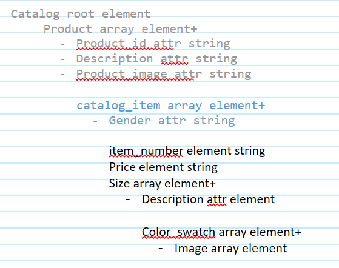
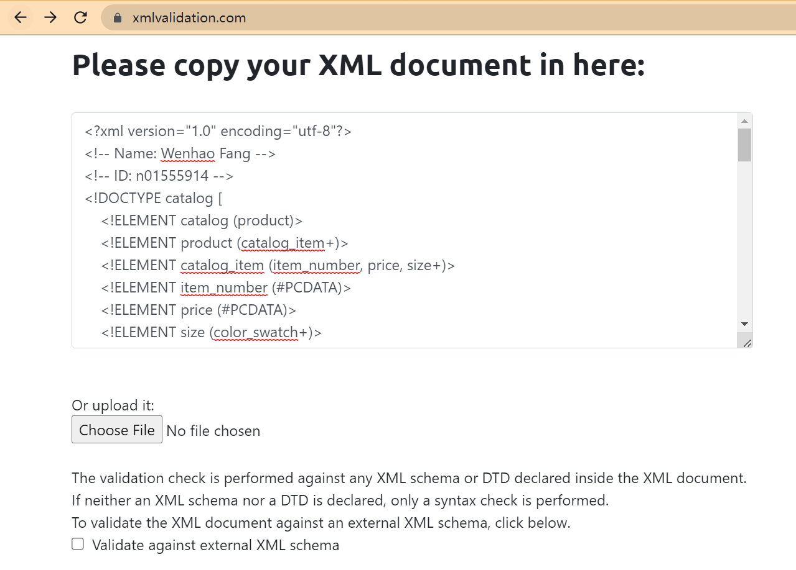
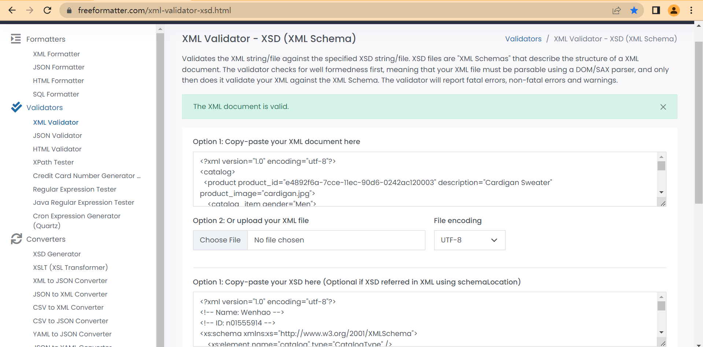

# Module03 - Assignment

- Name: Wenhao Fang
- ID: n01555914

---

## 1. Process for DTD

1. Breaks down the xml into a hierarchical outline, marking elements, attributes, and datatype.

2. According to the hierarchical outline, a DTD declaration is created. (See the file assignment_DTD.xml)

3. Verifies xml code with DTD on the given website.

---

## 2. Process for DTD

1. Uses the above hierarchical outline to create a xsd file (See the file assignment_XSD.xsd)

2. Verifies xml code with XSD on the given website.

---
