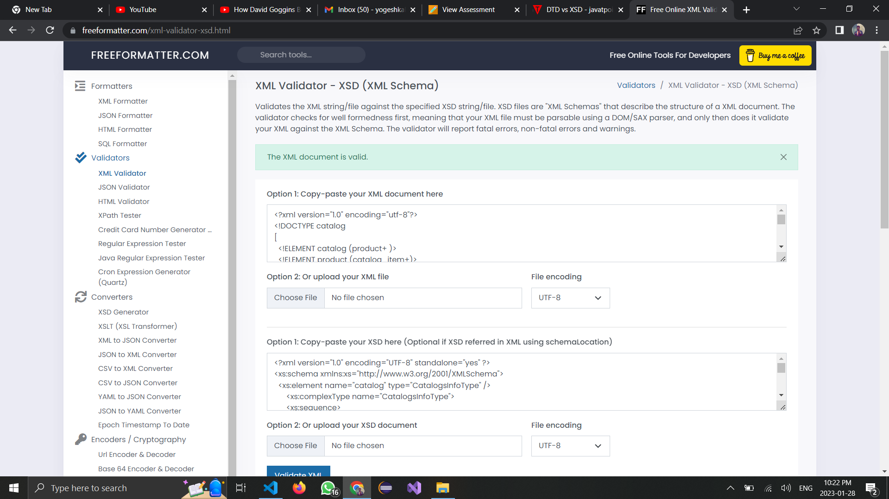

2. Create DTD for this file and validate it using any of the tools we used

3. Create XSD for this file and validate it using any of the tools we used

4. Explain your thought process for these 2 declarations
 The XSD Declaration is more informative as we can declare different data types in the xsd where as in case of DTD we cant specify the data types.
 The dtd file is stored in the same file whereas for xsd a different file is created.