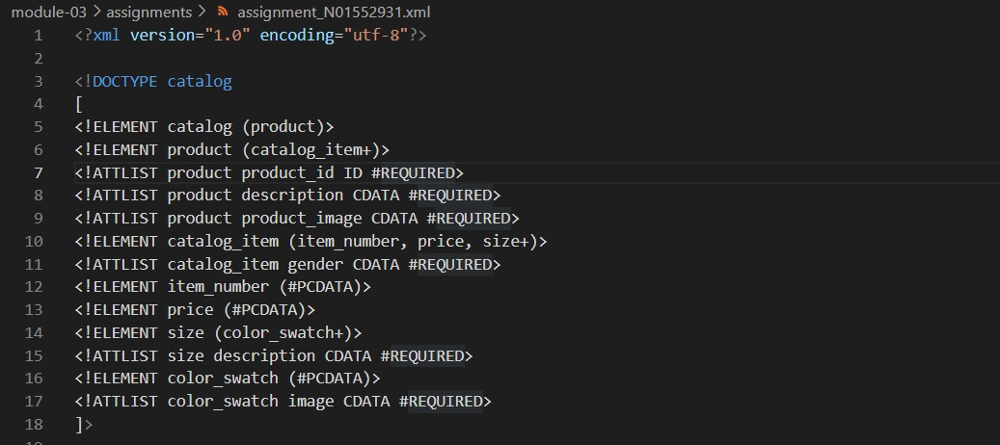
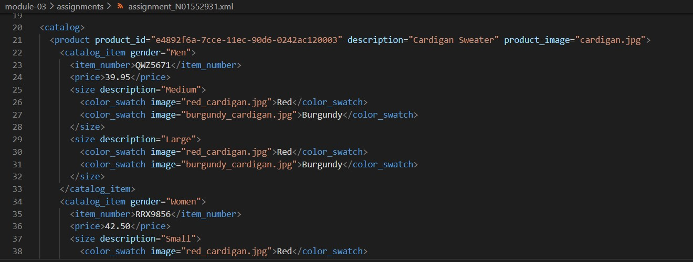
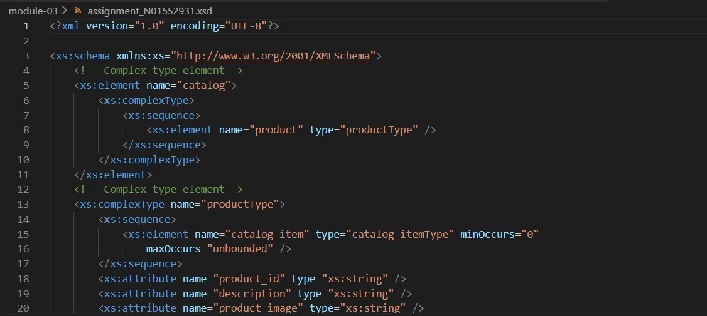
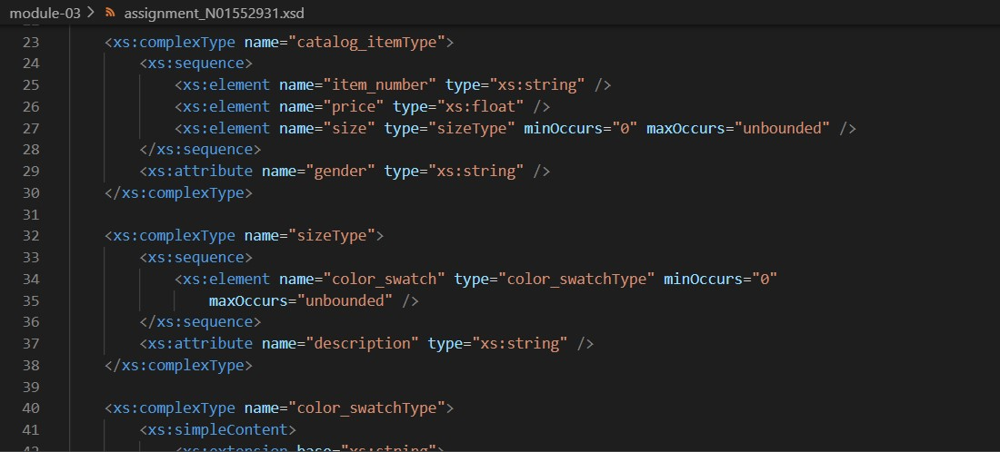
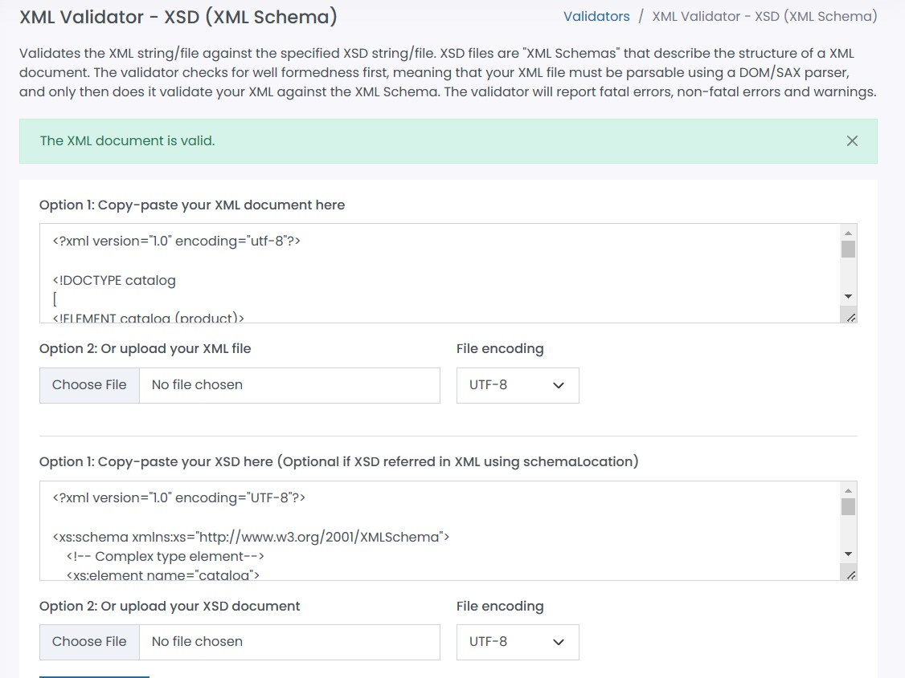

 #Assignment

1. Open `module-3/assignments/assignment.xml` in your editor.
2. Create DTD for this file and validate it using any of the tools we used
  
  

3. Create XSD for this file and validate it using any of the tools we used
 
 
 

4. Explain your thought process for these 2 declarations
While DTD does not support datatypes, XML schemas provide datatypes for elements and attributes. DTD does not support namespaces, whereas XML schemas do. XSD is more easy to read and understand and are more well-defined than DTD. Hence, I think XSD is better than DTD

Create `module-3/assignments/assignment_YOURNAME.md` and add your theory answers. Add screenshots of each step to the file.