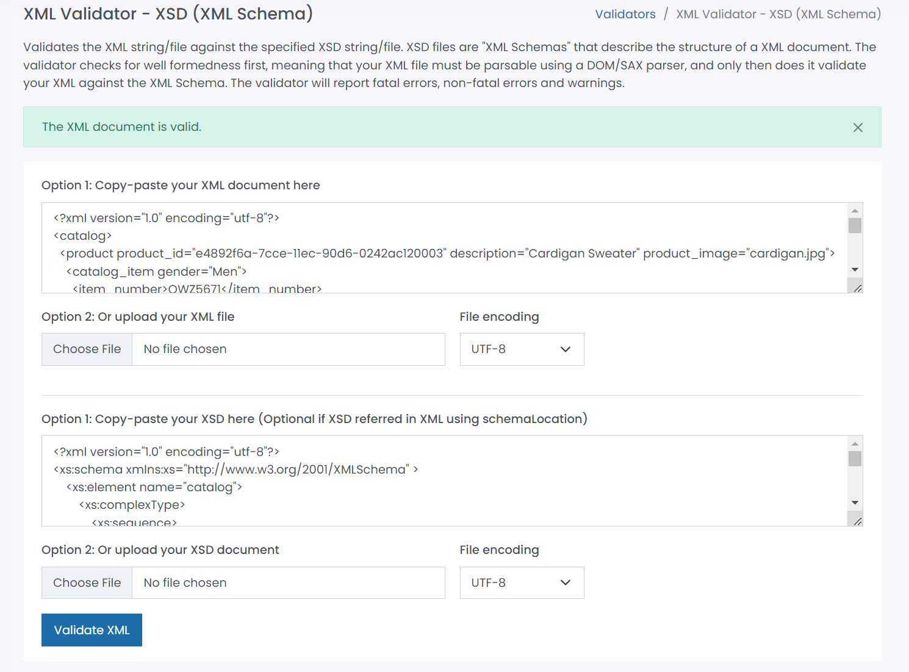

# answer 2

assignment.xml

validator

# answer 3

assignment.xsd

validator

# answer 4

The main difference between the two is xsd is easy to read as compare to dtd. When we read both the declaration without seeing the xml documentation, xsd is easy to understand as it has its own element in sequence and attributes along with its datatypes. 

