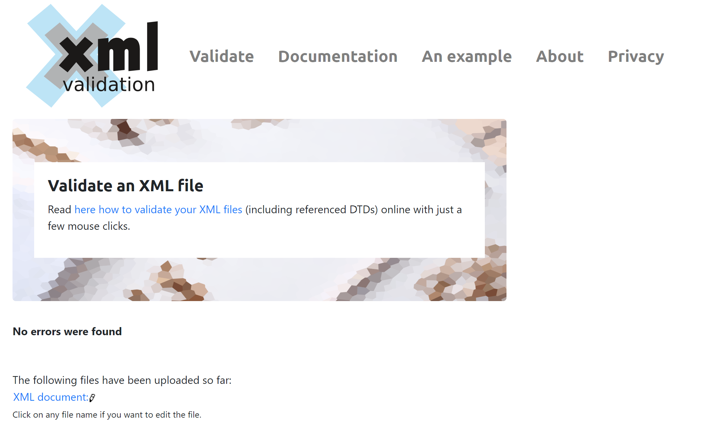

## Assignment - module03
## Leon Czarlinski - n01541167

2. Create DTD for this file and validate it using any of the tools we used
- 
- 

3. Create XSD for this file and validate it using any of the tools we used
 - [ref](../assignments/assignmentXSD.xsd)
 - [image](../assignments/assignment-xsd-validation.png)

4. Explain your thought process for these 2 declarations
 - [X] This time, to write the DTD was faster compared to the first time. Also, it was easy to fix the errors during validation.
 - [X] It felt easier to write DTD compared to XSD, but I do understand that XSD is better, because is more specific.
 - [X] It took me a while to create the XSD file, even with the fresh concepts in the head after class. It looks a bit confusing, specially when it comes to define what is simple and complex.
 - [X] Validaton was the most challenging part, mainly because it was hard to understad the errors and what they meant.

