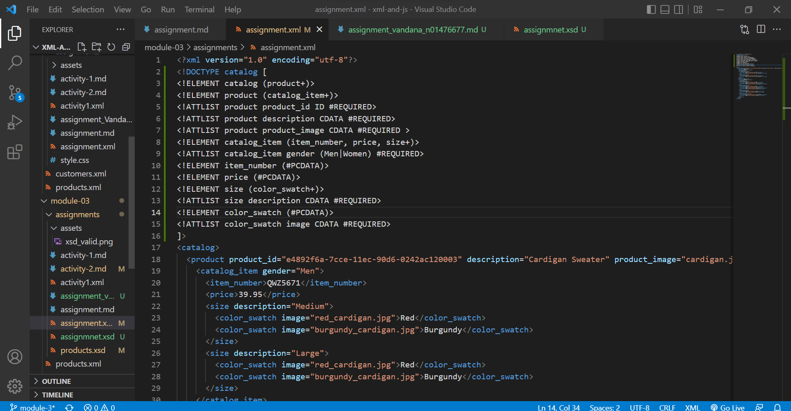
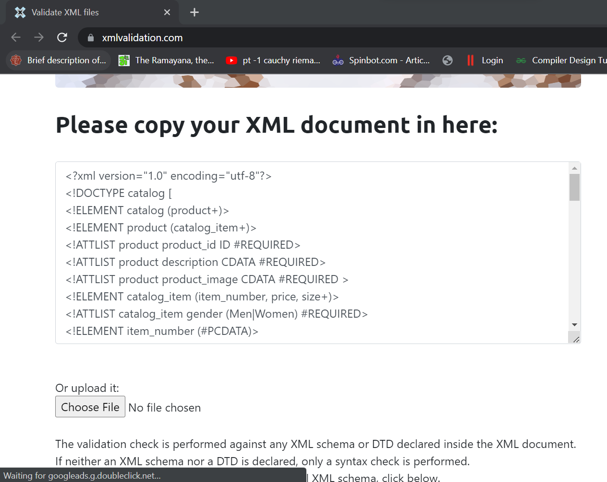
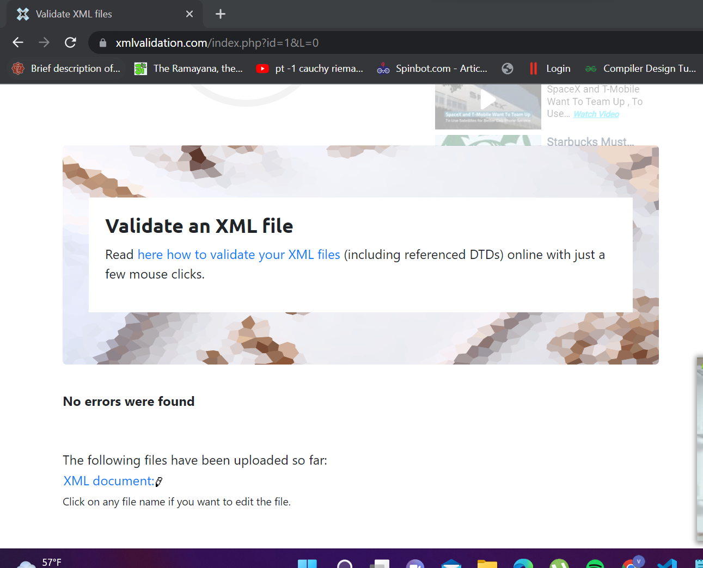
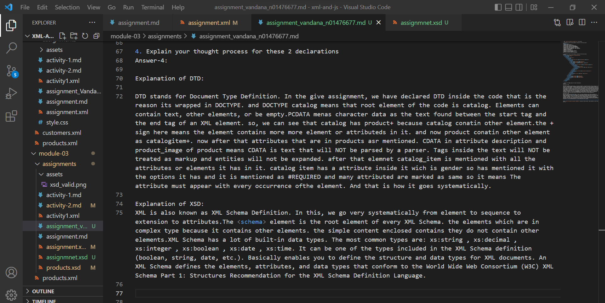
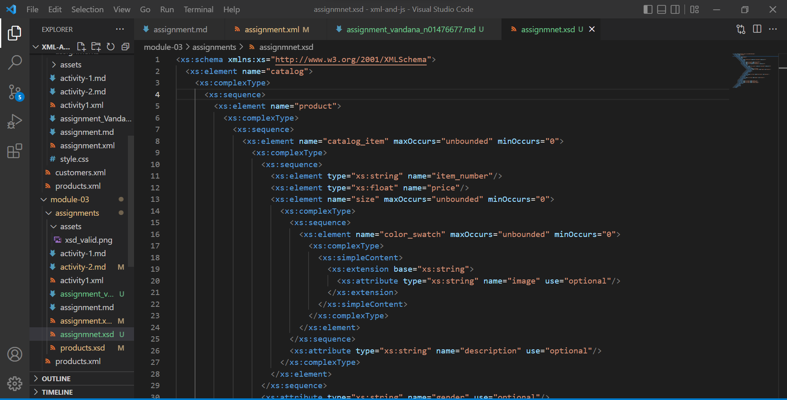
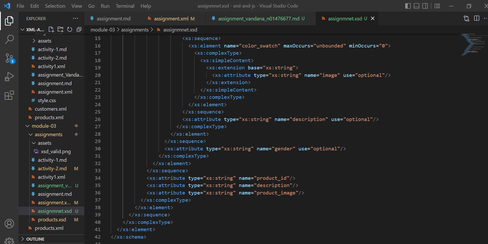
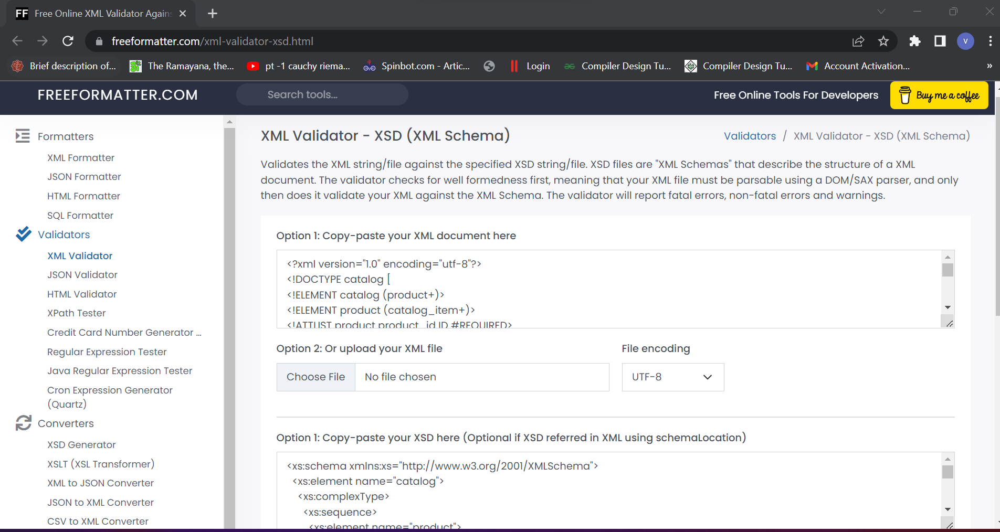
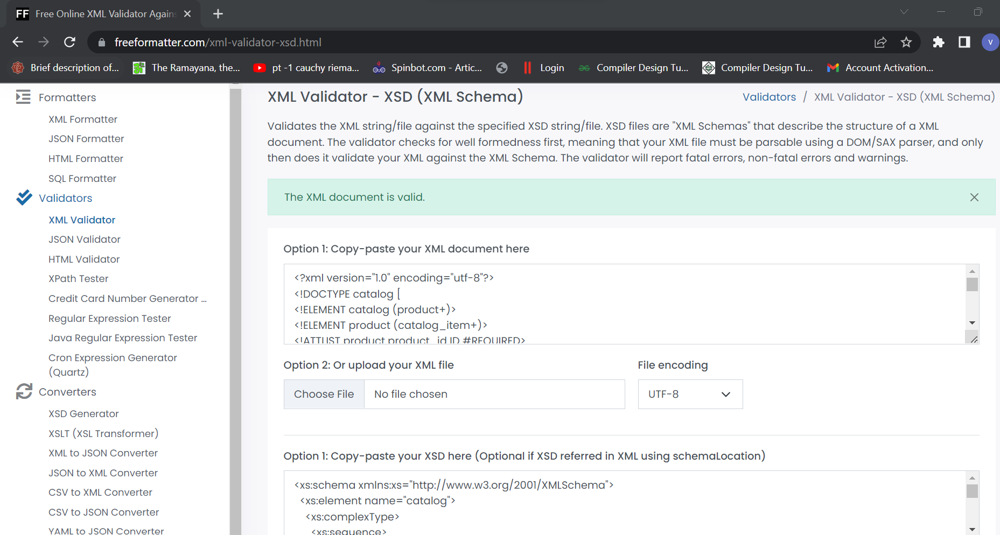

1. Open `module-3/assignments/assignment.xml` in your editor

2. Create DTD for this file and validate it using any of the tools we used
Answer -2:
<!DOCTYPE catalog [
<!ELEMENT catalog (product+)>
<!ELEMENT product (catalog_item+)>
<!ATTLIST product product_id ID #REQUIRED>
<!ATTLIST product description CDATA #REQUIRED>
<!ATTLIST product product_image CDATA #REQUIRED >
<!ELEMENT catalog_item (item_number, price, size+)>
<!ATTLIST catalog_item gender (Men | Women) #REQUIRED>
<!ELEMENT item_number (#PCDATA)>
<!ELEMENT price (#PCDATA)>
<!ELEMENT size (color_swatch+)>
<!ATTLIST size description CDATA #REQUIRED>
<!ELEMENT color_swatch (#PCDATA)>
<!ATTLIST color_swatch image CDATA #REQUIRED>
]>

3. Create XSD for this file and validate it using any of the tools we used
Answer-3:
<xs:schema xmlns:xs="http://www.w3.org/2001/XMLSchema">
  <xs:element name="catalog">
    <xs:complexType>
      <xs:sequence>
        <xs:element name="product">
          <xs:complexType>
            <xs:sequence>
              <xs:element name="catalog_item" maxOccurs="unbounded" minOccurs="0">
                <xs:complexType>
                  <xs:sequence>
                    <xs:element type="xs:string" name="item_number"/>
                    <xs:element type="xs:float" name="price"/>
                    <xs:element name="size" maxOccurs="unbounded" minOccurs="0">
                      <xs:complexType>
                        <xs:sequence>
                          <xs:element name="color_swatch" maxOccurs="unbounded" minOccurs="0">
                            <xs:complexType>
                              <xs:simpleContent>
                                <xs:extension base="xs:string">
                                  <xs:attribute type="xs:string" name="image" use="optional"/>
                                </xs:extension>
                              </xs:simpleContent>
                            </xs:complexType>
                          </xs:element>
                        </xs:sequence>
                        <xs:attribute type="xs:string" name="description" use="optional"/>
                      </xs:complexType>
                    </xs:element>
                  </xs:sequence>
                  <xs:attribute type="xs:string" name="gender" use="optional"/>
                </xs:complexType>
              </xs:element>
            </xs:sequence>
            <xs:attribute type="xs:string" name="product_id"/>
            <xs:attribute type="xs:string" name="description"/>
            <xs:attribute type="xs:string" name="product_image"/>
          </xs:complexType>
        </xs:element>
      </xs:sequence>
    </xs:complexType>
  </xs:element>
</xs:schema>

4. Explain your thought process for these 2 declarations
Answer-4: 

Explanation of DTD:

DTD stands for Document Type Definition. In the give assignment, we have declared DTD inside the code that is the reason its wrapped in DOCTYPE. and DOCTYPE catalog means that root element of the code is catalog. Elements can contain text, other elements, or be empty.PCDATA menas character data as the text found between the start tag and the end tag of an XML element. so, we can see that catalog has product+ because catalog conatin other element.the + sign here means the element contains more more element or attributeds in it. and now product conatin other element as catalogitem+. now after that attributes that are in products asr mentioned. CDATA in attribute description and product_image of product means CDATA is text that will NOT be parsed by a parser. Tags inside the text will NOT be treated as markup and entities will not be expanded. after that elemnet catalog_item is mentioned with all the attributes or elements it has in it. catalog item has a attribute inside it wich is gender so has mentioned it with the options it has and it is mentioned as #REQUIRED and many attributed are marked as same so it means The attribute must appear with every occurrence ofthe element. And that is how it goes systematically. 

Explanation of XSD:
XML is also known as XML Schema Definition. In this, we go very systematically from element to sequence to extension to attributes.The <schema> element is the root element of every XML Schema. the elements which are in complex type because it contains other elements. the simple content enclosed contains they do not contain other elements.XML Schema has a lot of built-in data types. The most common types are: xs:string , xs:decimal , xs:integer , xs:boolean , xs:date , xs:time. It can be one of the types included in the XML Schema definition (boolean, string, date, etc.). Basically enables you to define the structure and data types for XML documents. An XML Schema defines the elements, attributes, and data types that conform to the World Wide Web Consortium (W3C) XML Schema Part 1: Structures Recommendation for the XML Schema Definition Language.

Create `module-3/assignments/assignment_YOURNAME.md` and add your theory answers. Add screenshots of each step to the file.

