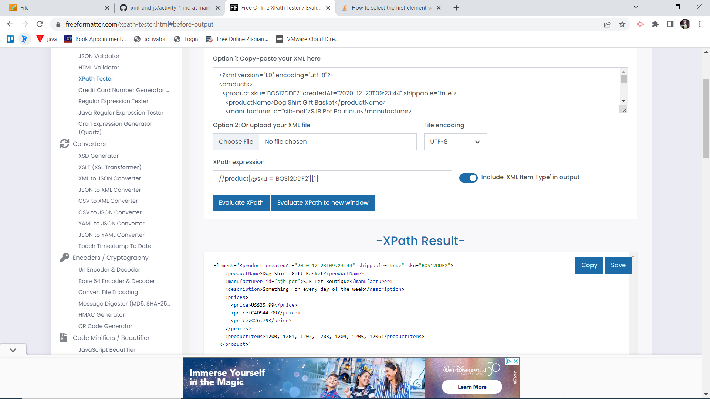
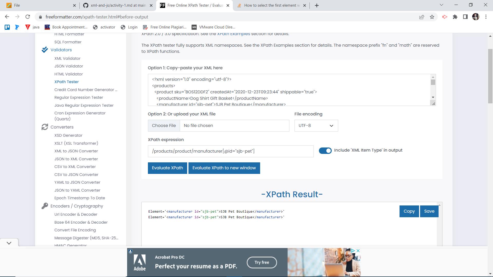

# 1. Target 2nd product in the list
//product[2]

# 2. Target last product in the list
//product[last()]

# 3. Target `sku` attribute of the first product
//product[@sku = 'BOS12DDF2'][1]

# 4.Target all products with manufacturer id `sjb-pet`

/products/product/manufacturer[@id="sjb-pet"]
