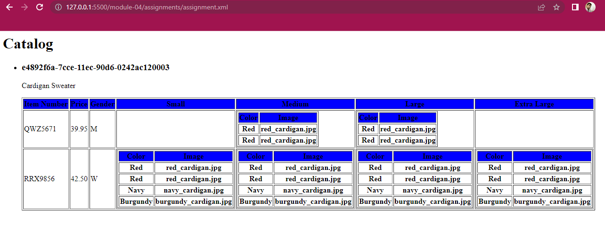

# In this assignment at first we print CATALOG as the main heading. I used h1 tag t0 make it a heading
#   and for-each method or tag is used to render the items one by one then article tag is used to render each item inside the catalog
# As required in the question the attribute product id is used in h3 tag and product description in p tag.

# I created a table with the columns Item Number, Price, Gender, Small, Medium, Large, Large, Extra Large

# Gender column has the condition if the gender is men, we will display M and if the gender is Women we will display W.

# We will add the tables with columns COLOR and IMAGE in the  Size(Small, Medium, Large) columns.

# If there is no size for a specific item number the we will leave it as a blank column.

