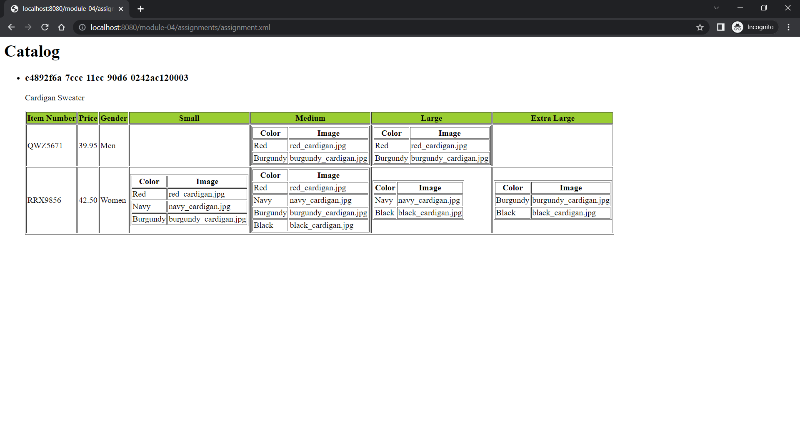

I have displayed the Catalog using h1 tag which is the parent node of the xml file. Product which is a child node of catalog is added using for each loop and the attributes of Product are displayed using h3 tag which are product id and description. I have used for loop for entering the data in rows of the table. I have used xsl:choose tag for choosing the data for Gender column. Further sizes columns are created with each rows having the data. I have used xsl:if to check if there is a null value to make the spaces empty in the table and for not null value a table is created with color column and image columns.