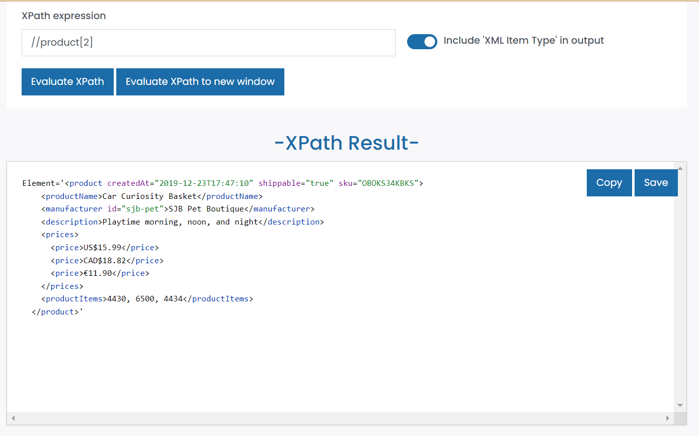
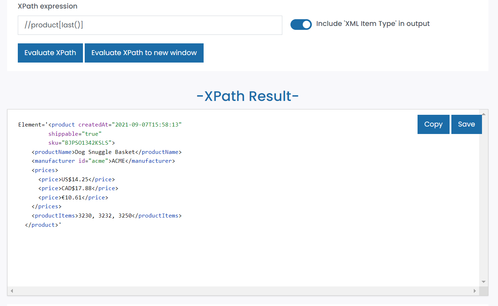
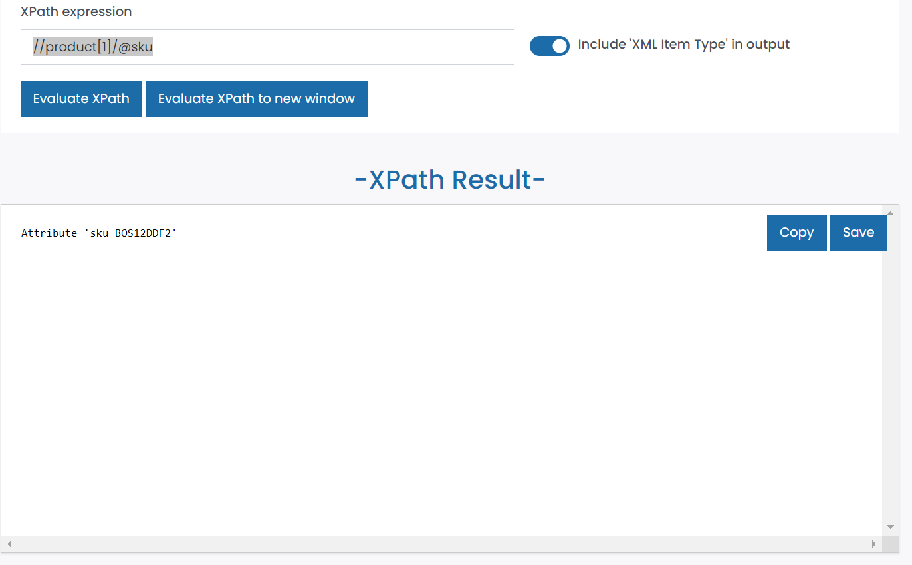
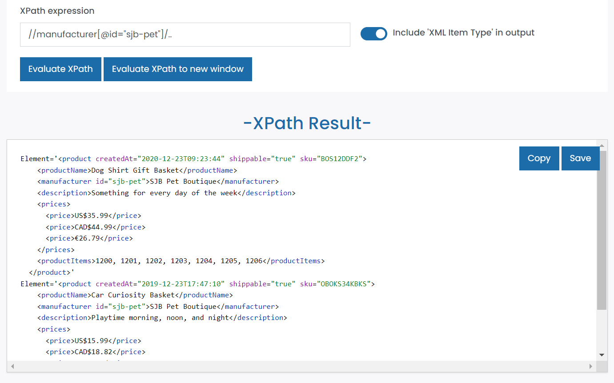
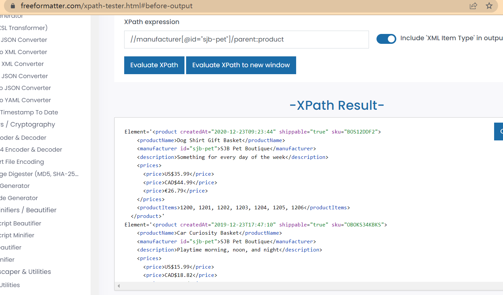

# Module-04 Activity-01

## Q1

- Target 2nd product in the list

  - XPath: `//product[2]`

  

---

## Q2

- Target last product in the list

  - XPath: `//product[last()]`

  

---

## Q3

- Target `sku` attribute of the first product

  - XPath: `//product[1]/@sku`

  

---

## Q4

- Target all products with manufacturer id `sjb-pet`

  - XPath 01: `//manufacturer[@id="sjb-pet"]/..`
    

  - XPath 02: `//manufacturer[@id="sjb-pet"]/parent::product`
    
