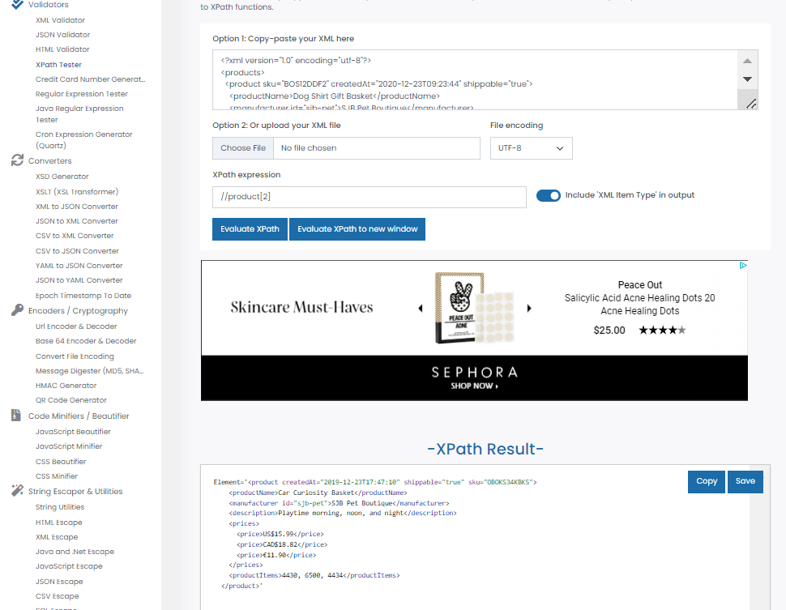
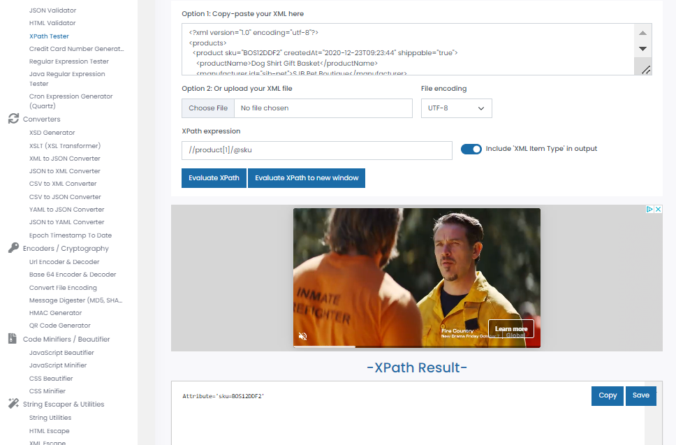
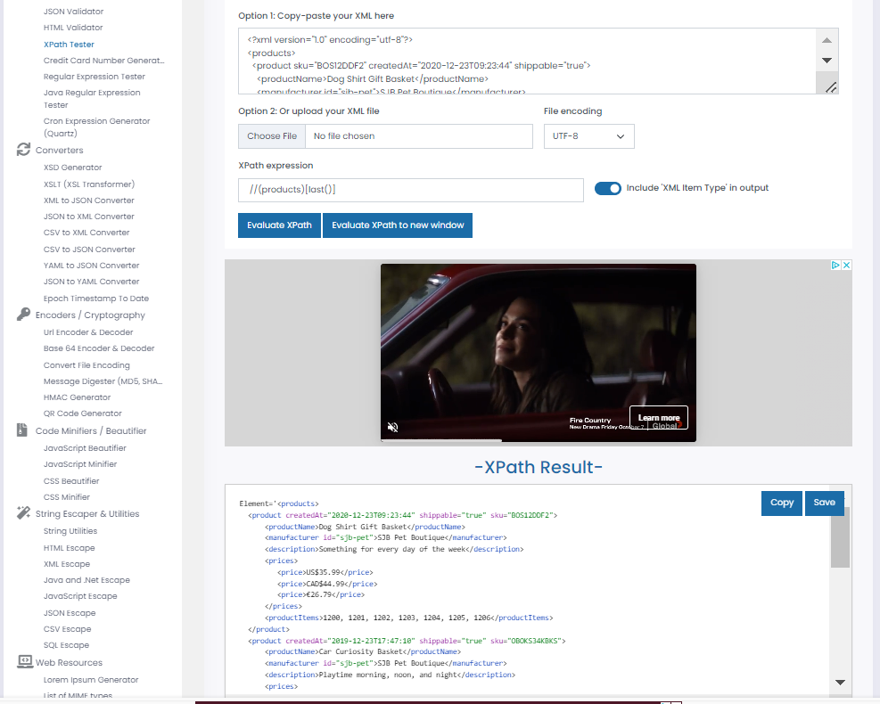
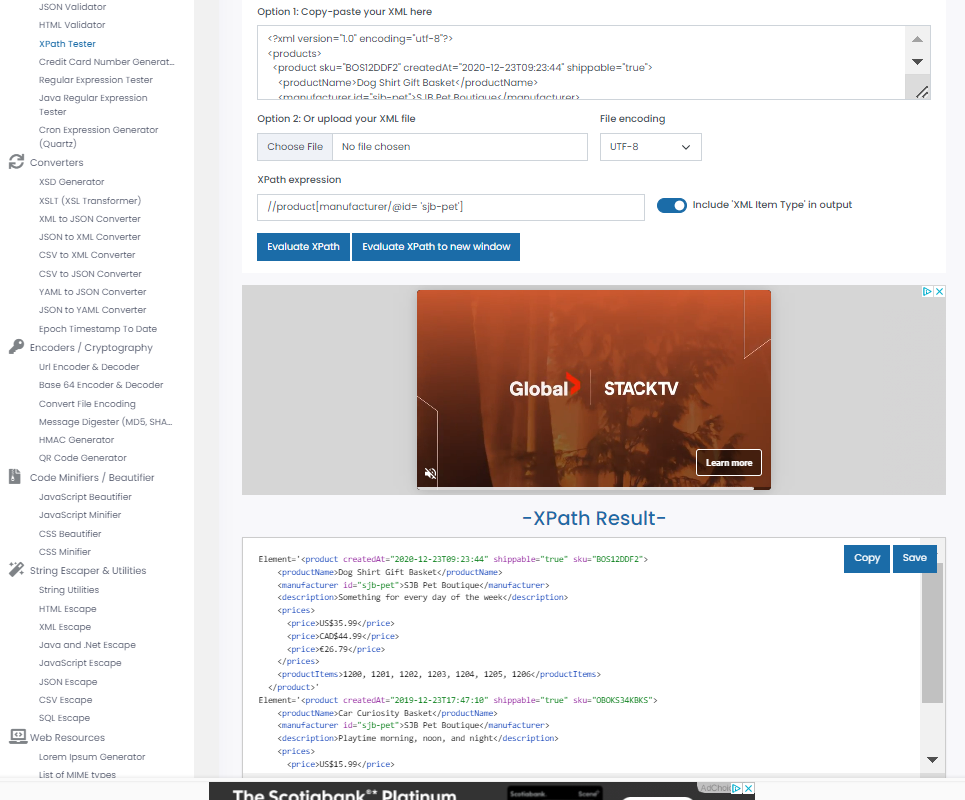

1. Target 2nd product in the list
Answer:1 //product[2]
2. Target last product in the list
Answer:2 //(products)[last()]
3. Target `sku` attribute of the first product
Answer3: //product[1]/@sku
4. Target all products with manufacturer id `sjb-pet`
Answer4://products[manufacturer/@id= 'sjb-pet']

