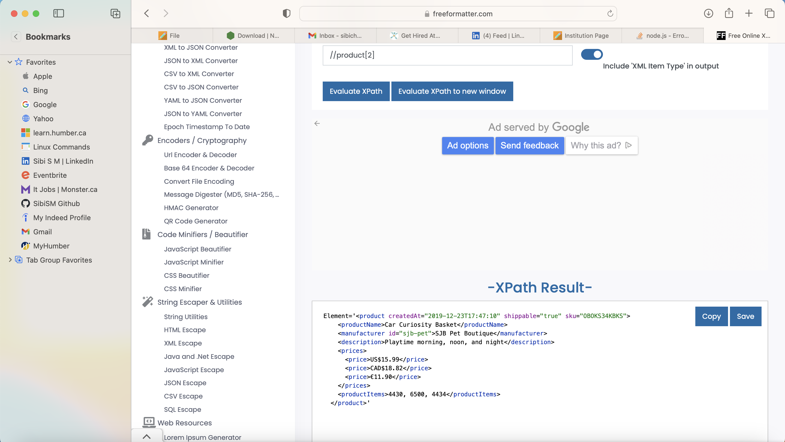
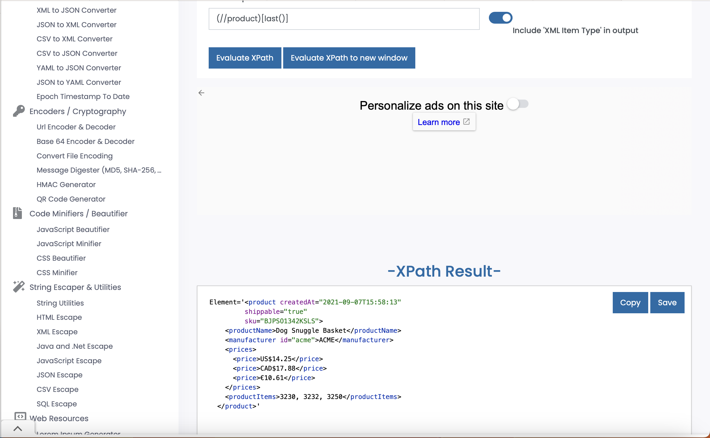
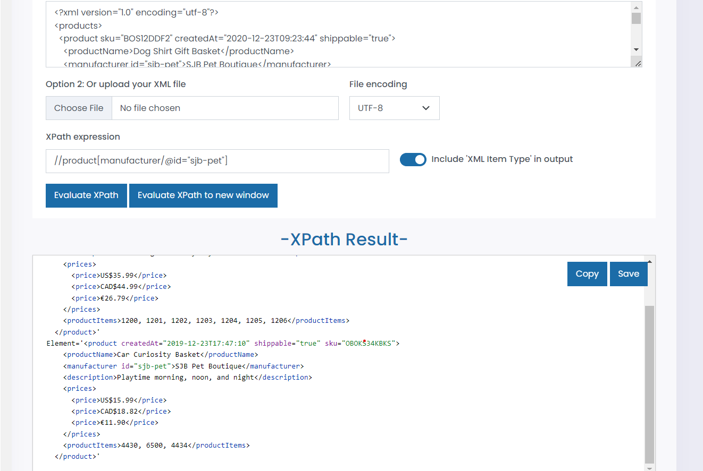

# Activity 1

Generate folowing XPath queries for `module-4/products.xml` file

1. Target 2nd product in the list
Ans: //products/product[2]

2. Target last product in the list
Ans: (//product)[last()]

3. Target `sku` attribute of the first product
Ans: //products/product[1]/@sku

4. Target all products with manufacturer id `sjb-pet`
Ans: /products/product/manufacturer[@id='sjb-pet']/ ..
