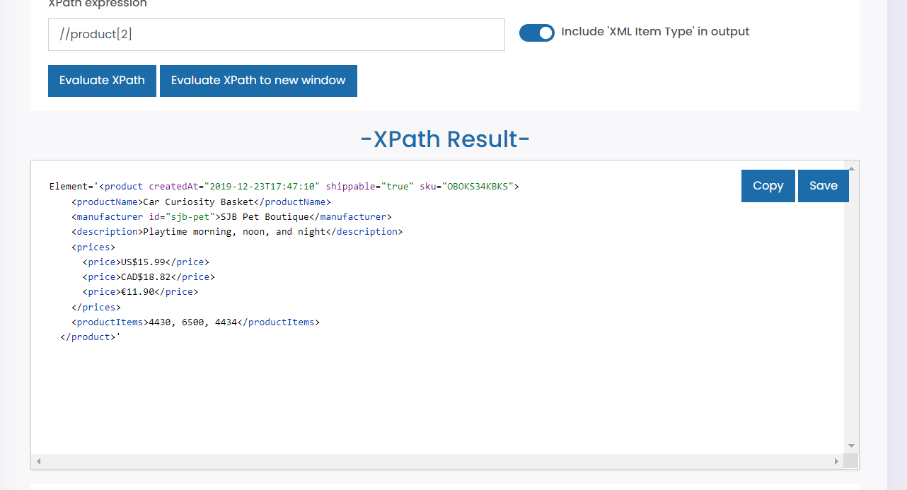
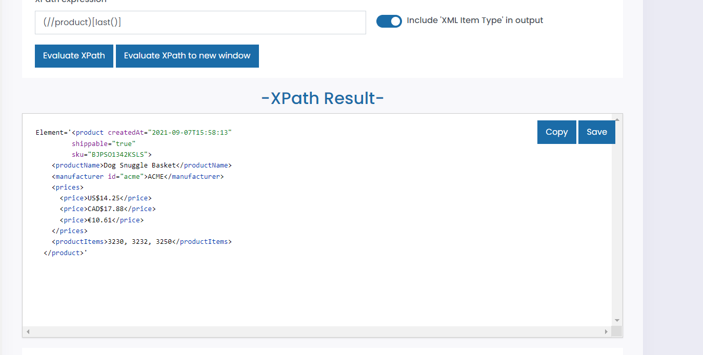
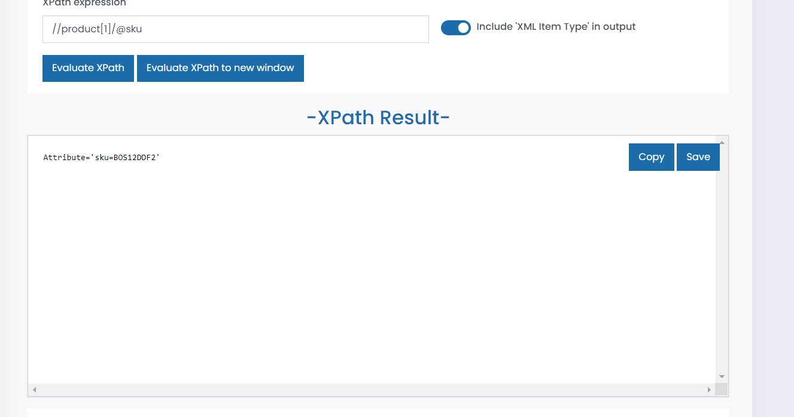
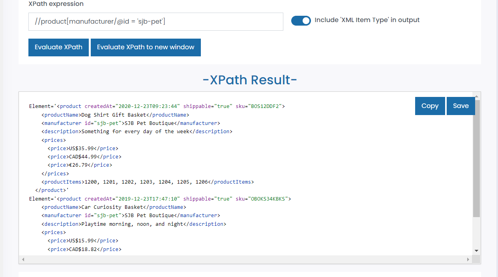

# Generate following XPath queries for module-4/products.xml file
- Target 2nd product in the list

    - //product[2]

    - 

- Target last product in the list

    - (//product)[last()]

    - 

- Target sku attribute of the first product

    - //product[1]/@sku

    - 

- Target all products with manufacturer id sjb-pet

    - //product[manufacturer/@id = 'sjb-pet']

    - 