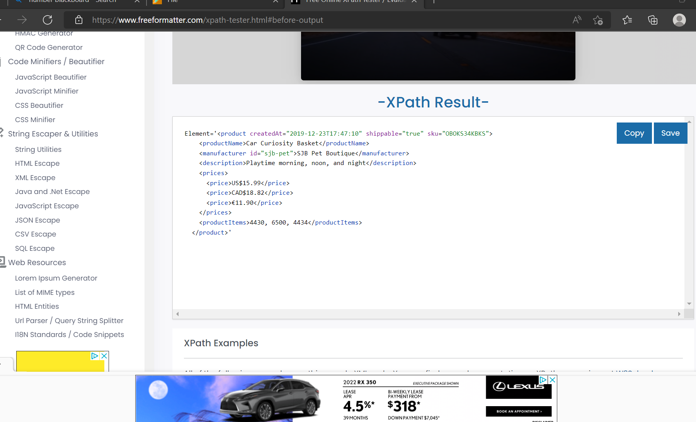
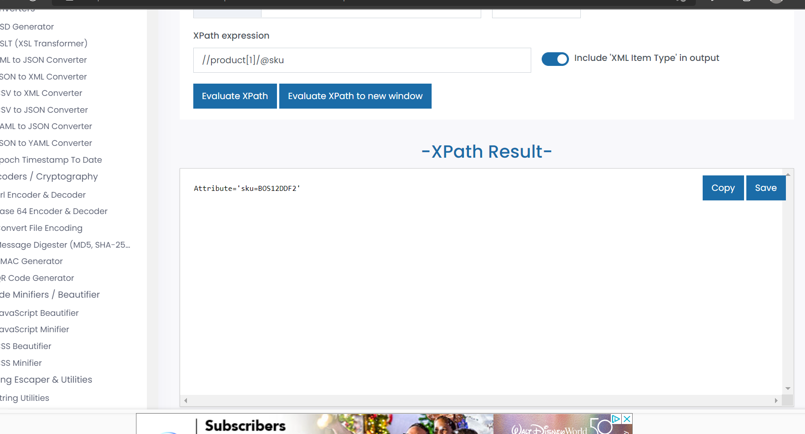
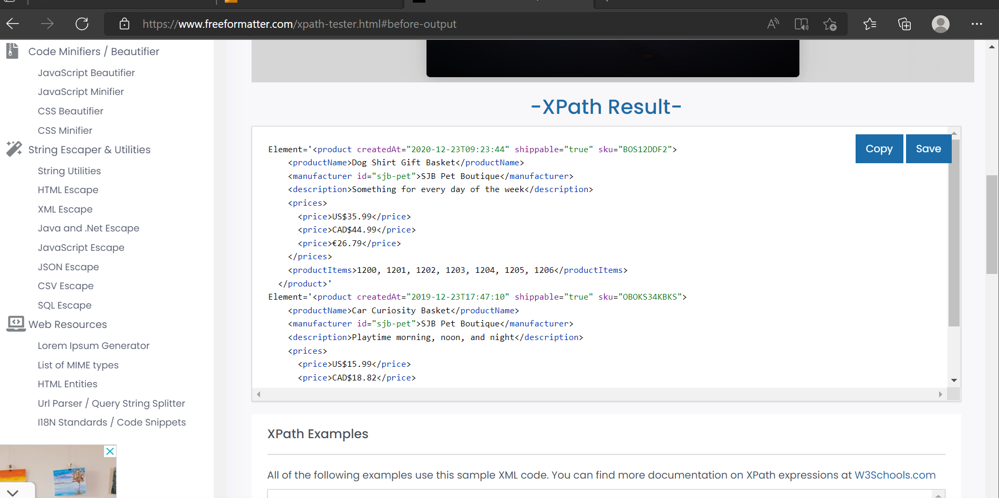
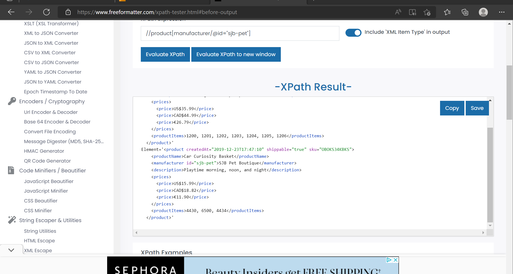

1. Target 2nd product in the list
Element='<product createdAt="2019-12-23T17:47:10" shippable="true" sku="OBOKS34KBKS">
    <productName>Car Curiosity Basket</productName>
    <manufacturer id="sjb-pet">SJB Pet Boutique</manufacturer>
    <description>Playtime morning, noon, and night</description>
    <prices>
      <price>US$15.99</price>
      <price>CAD$18.82</price>
      <price>€11.90</price>
    </prices>
    <productItems>4430, 6500, 4434</productItems>
  </product>'

2. Target last product in the list

Element='<product createdAt="2021-09-07T15:58:13"
         shippable="true"
         sku="BJPSO1342KSLS"> 
    <productName>Dog Snuggle Basket</productName>
    <manufacturer id="acme">ACME</manufacturer>
    <prices>
      <price>US$14.25</price>
      <price>CAD$17.88</price>
      <price>€10.61</price>
    </prices>
    <productItems>3230, 3232, 3250</productItems>
  </product>'
  
  ]

3. Target `sku` attribute of the first product

Attribute='sku=BOS12DDF2'
 ]

4. Target all products with manufacturer id `sjb-pet`#
Element='<product createdAt="2020-12-23T09:23:44" shippable="true" sku="BOS12DDF2">
    <productName>Dog Shirt Gift Basket</productName>
    <manufacturer id="sjb-pet">SJB Pet Boutique</manufacturer>
    <description>Something for every day of the week</description>
    <prices>
      <price>US$35.99</price>
      <price>CAD$44.99</price>
      <price>€26.79</price>
    </prices>
    <productItems>1200, 1201, 1202, 1203, 1204, 1205, 1206</productItems>
  </product>'
Element='<product createdAt="2019-12-23T17:47:10" shippable="true" sku="OBOKS34KBKS">
    <productName>Car Curiosity Basket</productName>
    <manufacturer id="sjb-pet">SJB Pet Boutique</manufacturer>
    <description>Playtime morning, noon, and night</description>
    <prices>
      <price>US$15.99</price>
      <price>CAD$18.82</price>
      <price>€11.90</price>
    </prices>
    <productItems>4430, 6500, 4434</productItems>
  </product>'

 ]
  ]