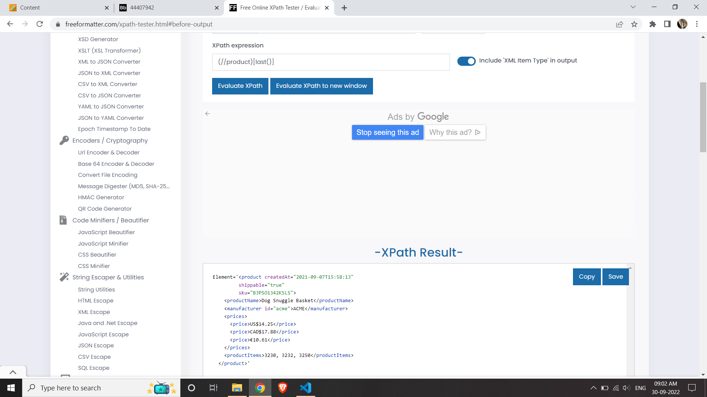
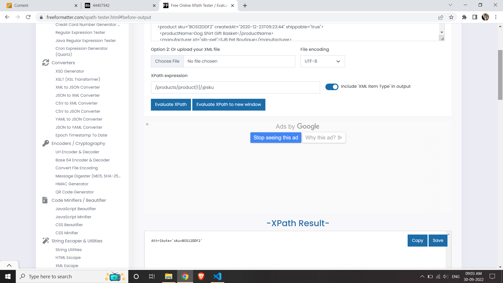
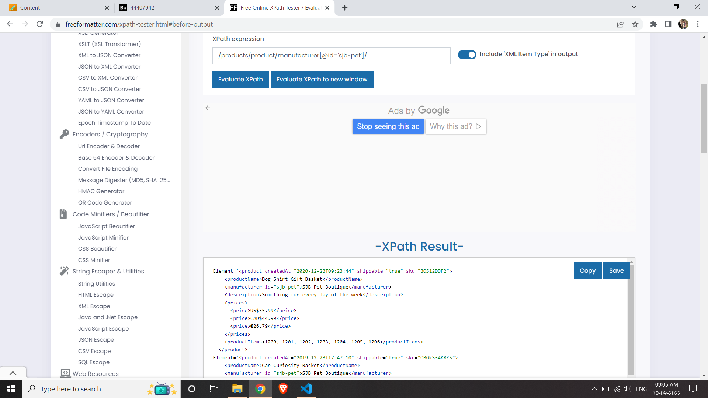

# Activity 1

Generate folowing XPath queries for `module-4/products.xml` file

1. Target 2nd product in the list
//product[2]

2. Target last product in the list
(//product)[last()]

3. Target `sku` attribute of the first product
/products/product[1]/@sku

4. Target all products with manufacturer id `sjb-pet`
/products/product/manufacturer[@id='sjb-pet']/..

Save your answers into `module-4/assignments/activity-1_STUDENTID.md` and attach screenshots

You can use <https://www.freeformatter.com/xpath-tester.html> to test your answers
