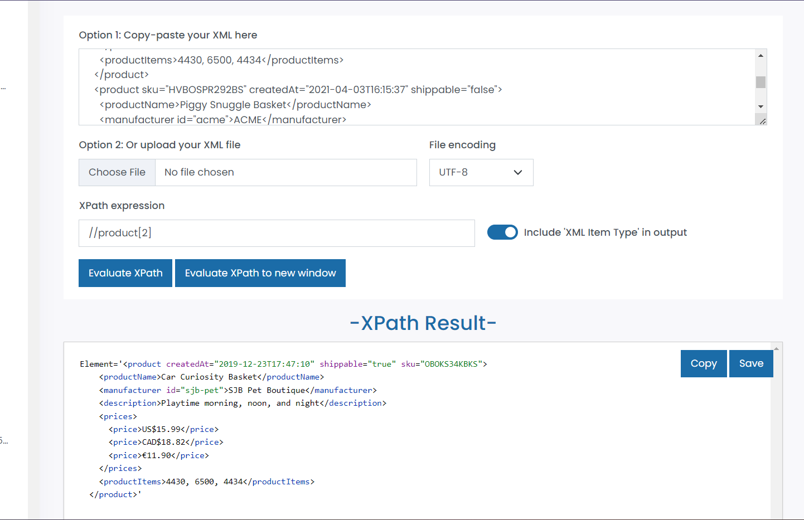
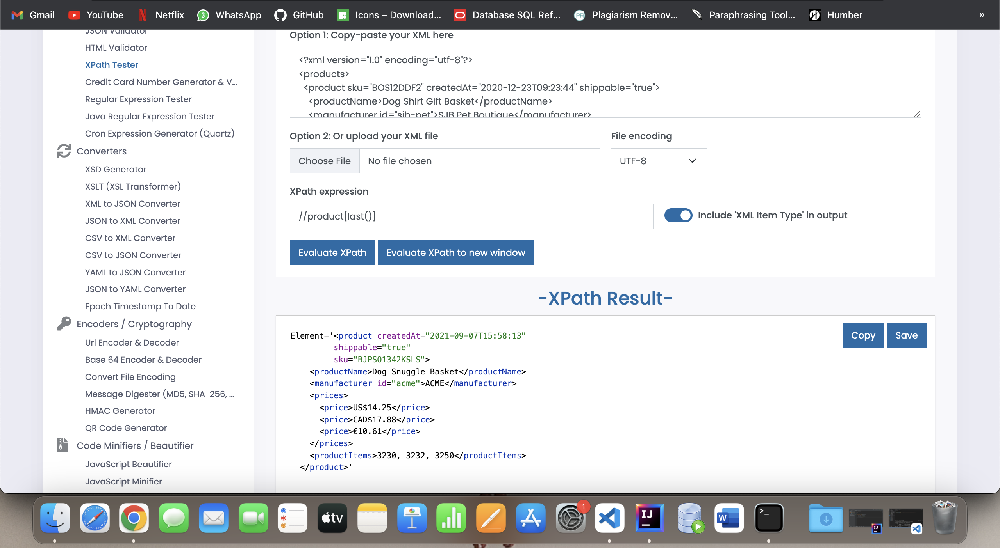
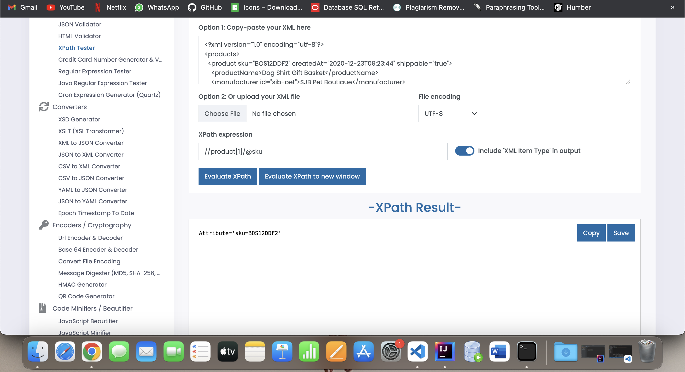
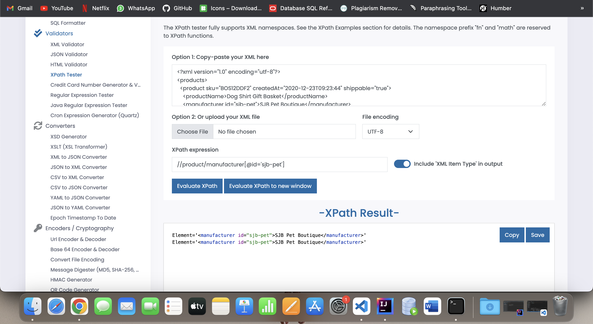

<!-- Name: Ronak A mangroliya -->

1. Target 2nd product in the list
ANS-1.   

2. Target last product in the list
ANS-2.   

3. Target `sku` attribute of the first product
ANS-3.   

4. Target all products with manufacturer id `sjb-pet`
ANS-4.   