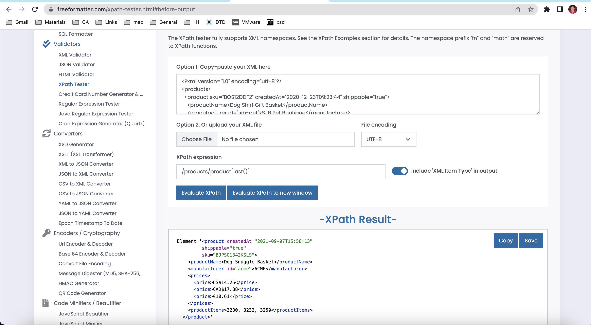

# Activity 1

Generate folowing XPath queries for `module-4/products.xml` file

1. Target 2nd product in the list
image: 
 

2. Target last product in the list
image: 
 

3. Target `sku` attribute of the first product
image: 
 

4. Target all products with manufacturer id `sjb-pet`

image: 
 

