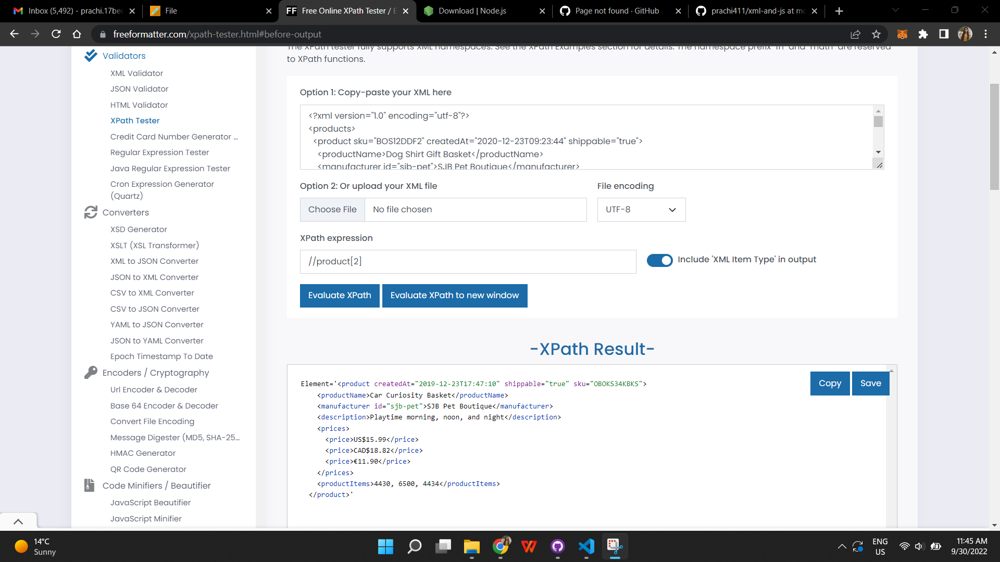
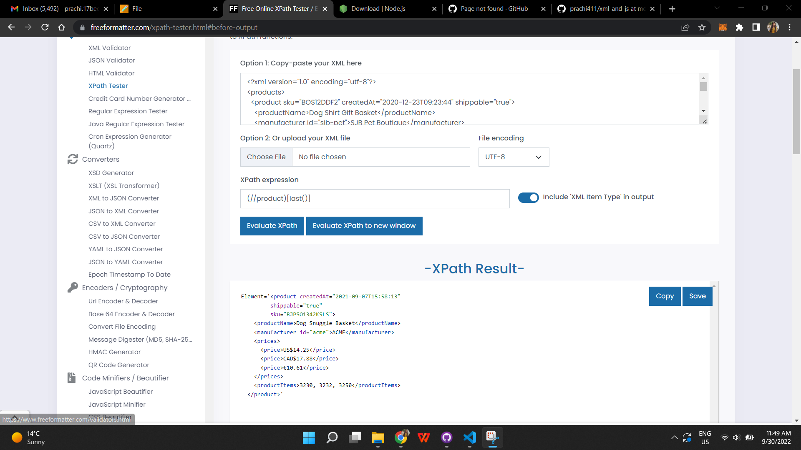
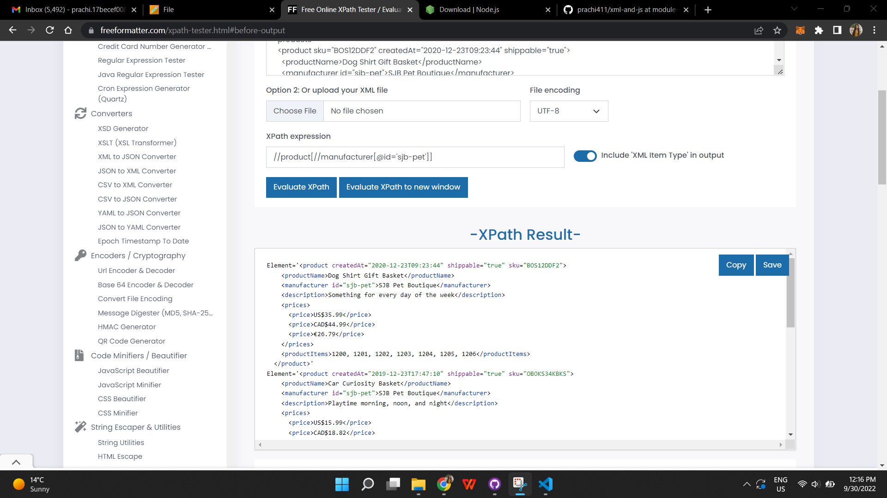

# module -04
# Activity - 1

1. Target 2nd product in the list

2. Target last product in the list

3. Target `sku` attribute of the first product

4. Target all products with manufacturer id `sjb-pet`

