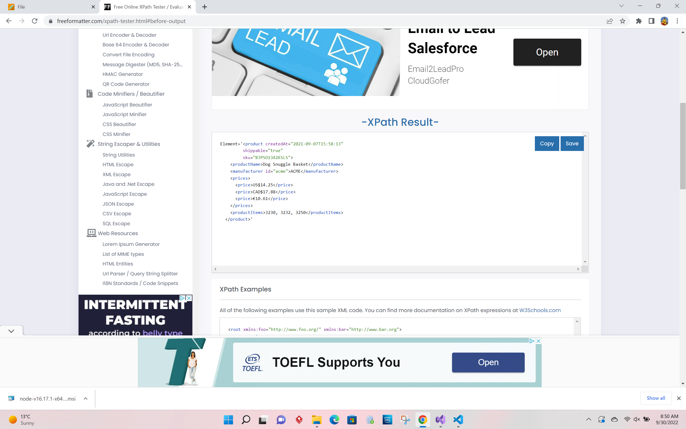
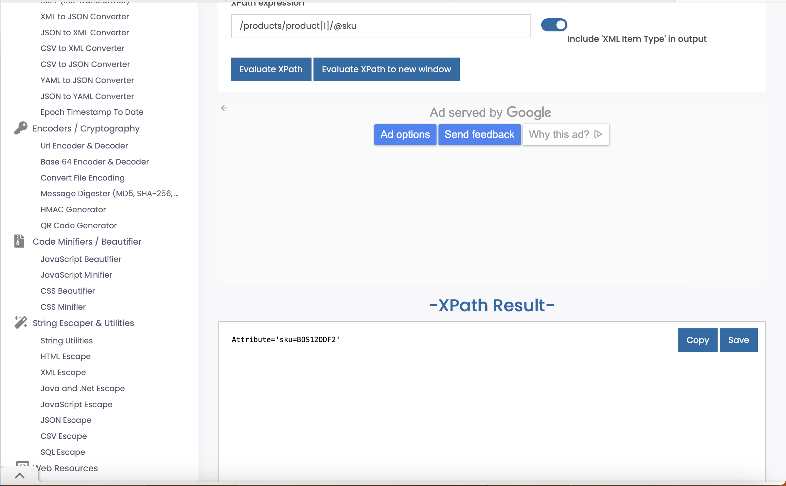
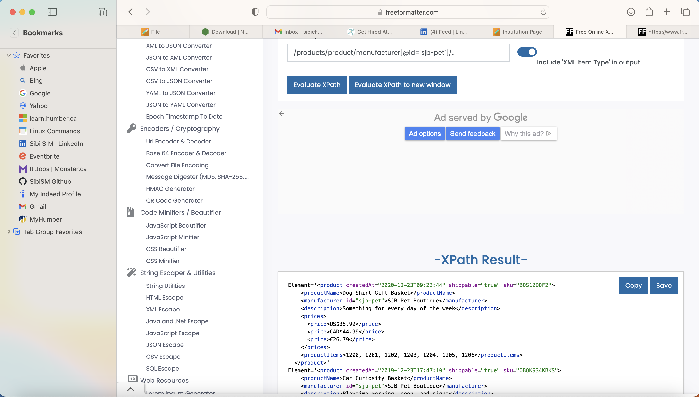
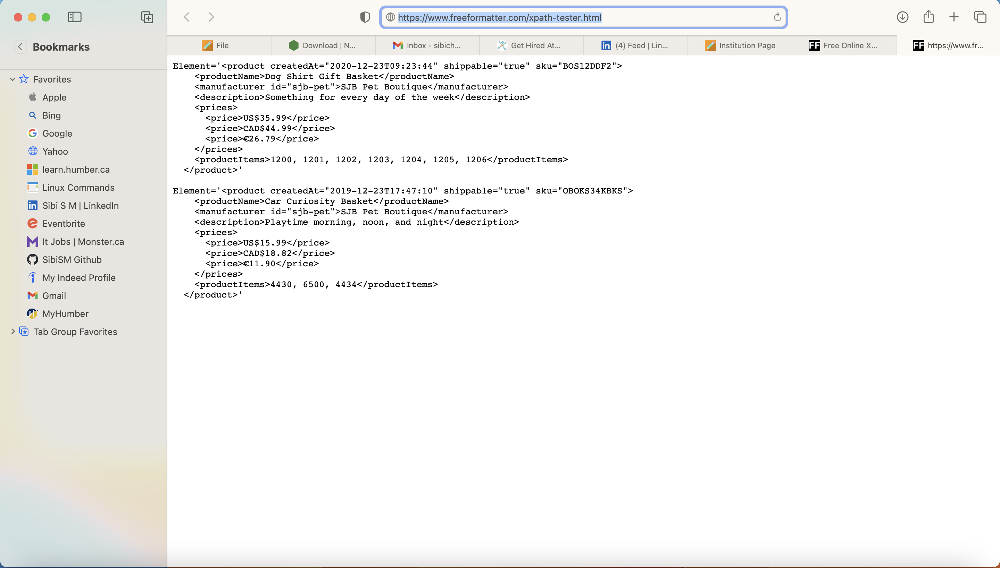

# Activity 1

Generate folowing XPath queries for `module-4/products.xml` file

1. Target 2nd product in the list
    XPath Command :  //product[2]
Below is the screenshot for reference.

2. Target last product in the list
    XPath Command :  (//product)[last()]

Below is the screenshot for reference.

3. Target `sku` attribute of the first product
    XPath Command :  //product[1]/@sku

Below is the screenshot for reference.

4. Target all products with manufacturer id `sjb-pet`
    XPath Command :  /products/product/manufacturer[@id="sjb-pet"]/..

Below is the screenshot for reference.
