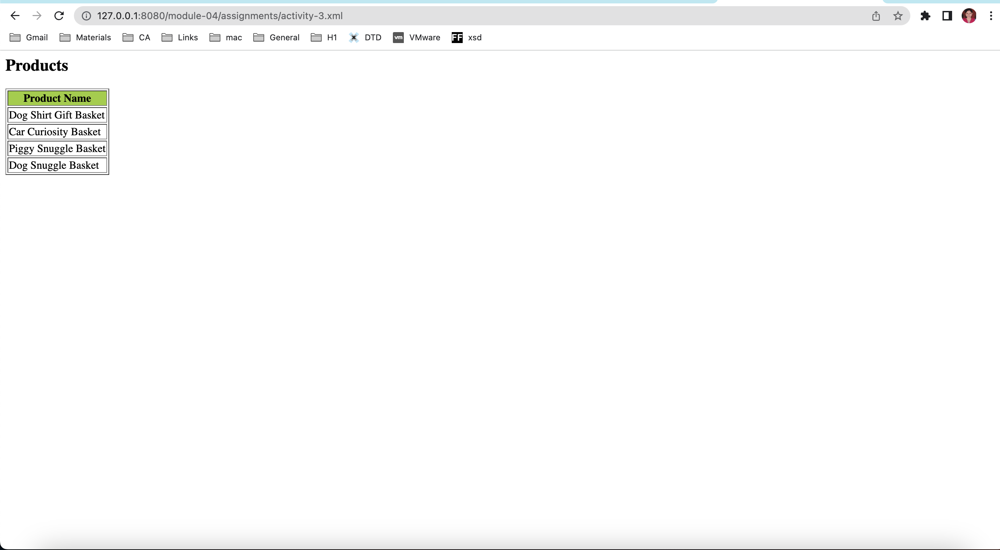

# Activity 3

1. Save `module-4/products.xml` as `module-4/assignments/activity-3.xml`
Created activity-3.xml file.

2. Create `module-4/assignments/activity-3.xsl` xsl file and display each product name (it can be any format. does not have to be html `<table>`)
created activity-3.xsl file and added xsl elements to add each product name

3. Link `module-4/assignments/activity-3.xml` and `module-4/assignments/activity-3.xsl`
Added <?xml-stylesheet type="text/xsl" href="activity-3.xsl"?> in xml file to link xml and xsl files.

4. Open `module-4/assignments/activity-3.xml` in browser (using `http-server`) and screenshot output of your file and save it as `module-4/assignments/activity-3.png`
image: 
 