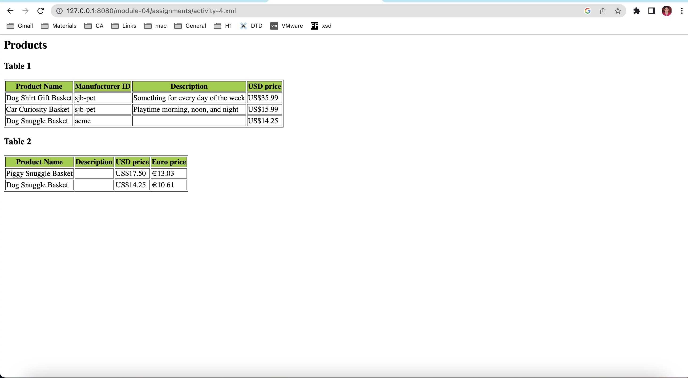

# Activity 4

1. Save `module-4/products.xml` as `module-4/assignments/activity-4.xml`
activity-4.xml is created

2. Create `module-4/assignments/activity-4.xsl` and link `module-4/assignments/activity-4.xml` to it
File : activity-4.xsl is created to add 2 tables. Also,Added <?xml-stylesheet type="text/xsl" href="activity-4.xsl"?> to xml file to link both xml and xsl files.

3. Add 2 tables from description below
File : activity-4.xsl is created to add 2 tables with 4 columns and related selections.

4. Open `module-4/assignments/activity-4.xml` in browser (using `http-server`) and screenshot output of your file and save it as `module-4/assignments/activity-4.png`
## Table 1

**Columns**: Product name, Manufacturer id, Description, USD price

**Condition**: shippable items

## Table 2

**Columns**: Product name, Description, USD price, Euro price

**Condition**: manufacturer id is "acme"

image: 
 