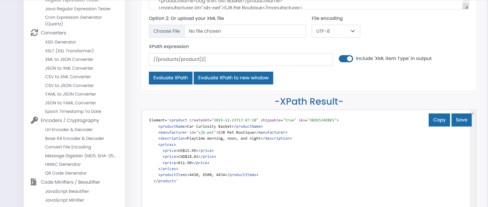
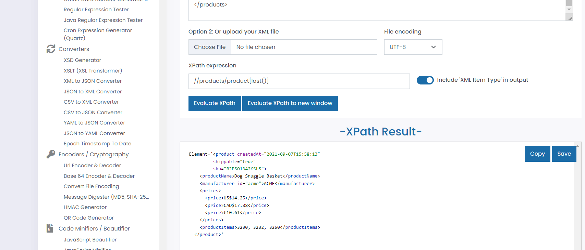
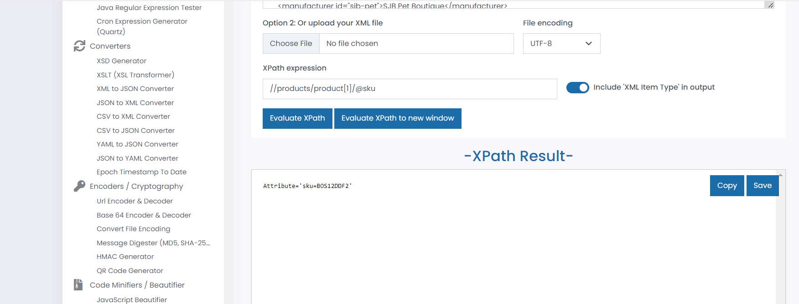
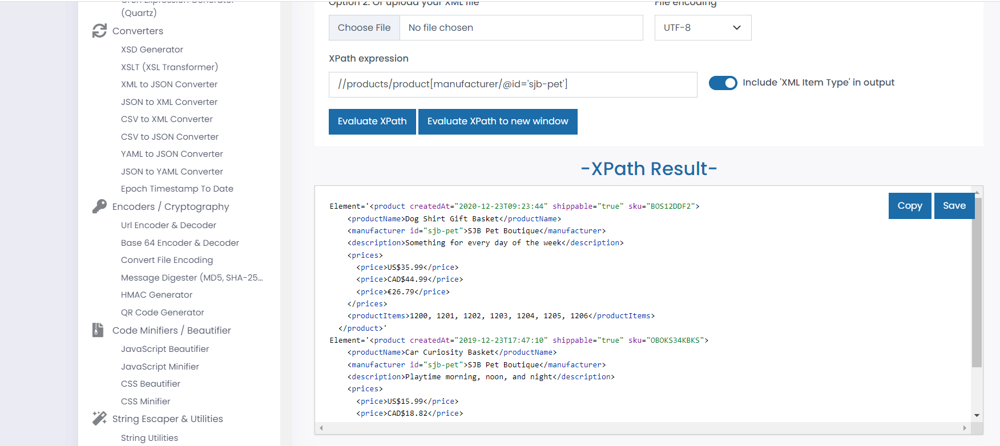

1. Target 2nd product in the list
Ans. //products/product[2]

2. Target last product in the list
Ans. //products/product[last()]

3. Target `sku` attribute of the first product
Ans. //products/product[1]/@sku

4. Target all products with manufacturer id `sjb-pet`
Ans. //products/product/manufacturer[@id='sjb-pet']/..

