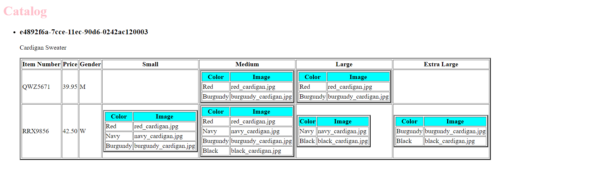

# Assignment

1. Open `module-4/assignments/assignment.xml` in your editor
2. Create xsl file and add link to it
3. Display catalog in the following way

- main title is "Catalog"
- use html list tag to display catalog
- render each item as `<article>` inside list item tag
- display product id as h3
- display product description as paragraph
- render table of catalog items with columns: item number, price, gender, small, medium, large, extra large (if column item is not present in item, then display empty cell)
- for gender column render M for Men, W for Women
- inside size columns (small, medium, large, and extra large) display subtable with 2 columns: color and image

Create `module-4/assignments/assignment_YOURNAME.md` and explain your thought process in it. Add screenshots of each step to the file (Refer `week-1/assignments/evaluation-1.md` on how to add image to md file)

Answer:

So here, i have used h1 tag for Catalog
then i created an unordered list in which i have article list item inside my <li>tag
to display product id i used h3 tag which selects the value <xsl:value of> selecting product id 
then i used the table border tag to display the catalog items in table format 
for the gender column i used <xsl:choose> to display M for men and W for women
to display all the data i used <xsl:value> for each row
then is i used <xls:if> to check that if value is not present so that  it can display empty cell.
and so i have displayed the size column with two columns color and image.

