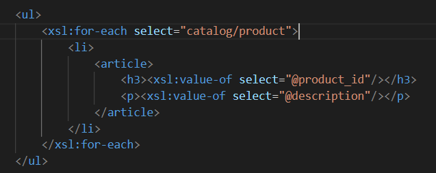
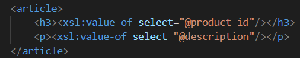
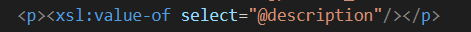
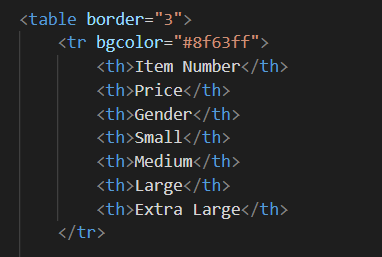
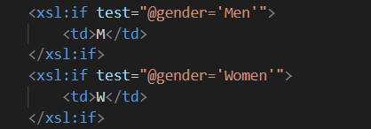
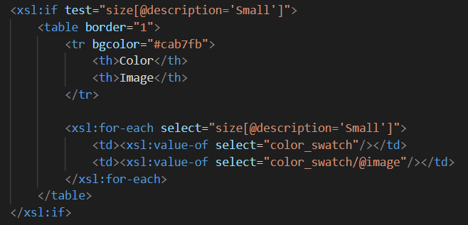

# Assignment

# Description of steps
- Display catalog in the following way

- main title is "Catalog"

    - put "Catalog" in 'h2' tag

- use html list tag to display catalog

    - used unordered list 'ul' and 'li' tags to show products in catalog in an unordered list style

    

- render each item as `<article>` inside list item tag

    - used 'article' tag to put all info about the product inside

    

- display product id as h3

    - used 'h3' tag to put product attribute 'id' inside the tag

    

- display product description as paragraph

    - used 'p' tag to display product attribute 'description' as paragraph

    

- render table of catalog items with columns: item number, price, gender, small, medium, large, extra large (if column item is not present in item, then display empty cell)

    - created table with columns listed above

    

- for gender column render M for Men, W for Women

    - created if statement for checking the gender atrribute value and if its 'Men' then put M, if 'Women' - 'W'

    

- inside size columns (small, medium, large, and extra large) display subtable with 2 columns: color and image

    - created a new table in each small/medium/large/extra large column with columns color and image. I checked if there is some value and only in that case created such tables. In the example belowe there is subtable for small size column

    

