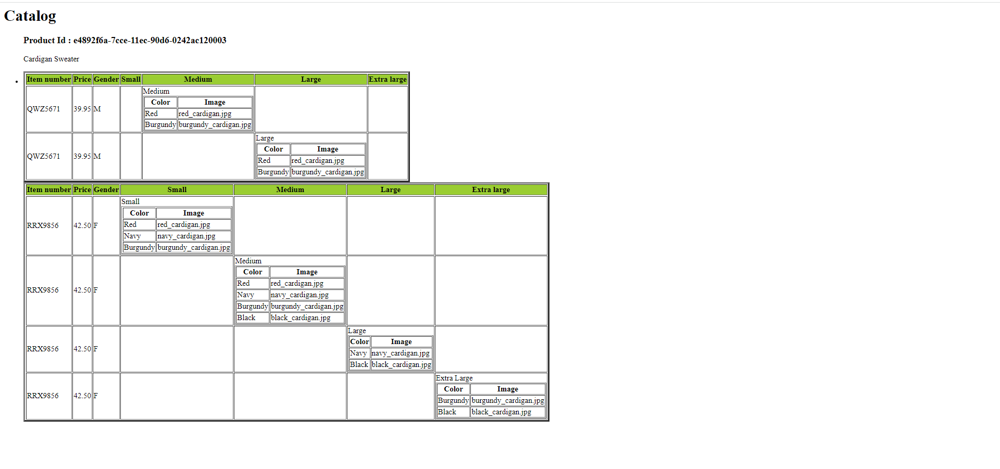

# Assignment:-

1.Created nested tabels to show the results.
2.Used When and otherwise medthod which is similar to switch case in other languages.
3.When gender is Men 'M' will be printed otherwise 'F' will be printed.
4.Similar with description of size element, also used when and otherwise method.
5.Used extra <td> to give specific spaces to columns.

