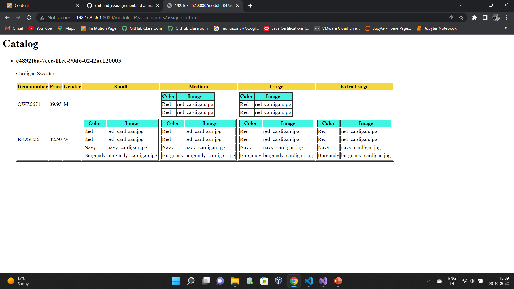

- Have used h1 tag to display the heading as Catalog
- As Mentioned Added Products in a list tag
- Added Product,Description and Table in the list wrapped under article tag.
- Under table added all mentioned columns and rendered appropiate data under each
- As mentioned condition for Gender changed Men to 'M' and Women to 'W'.
- And Rendered subtables for sizes with color and Image columns and data whereever the sizes are avilable if not showed empty cells.

