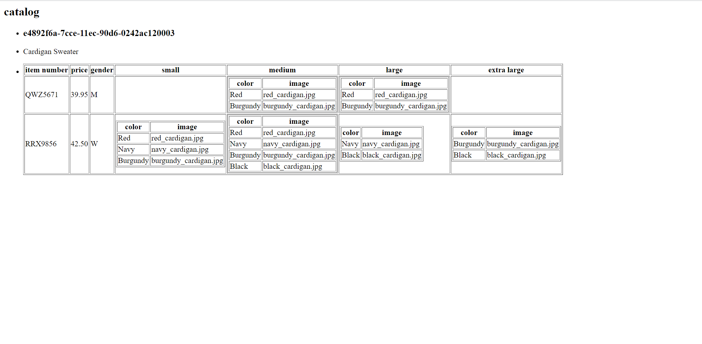

# Assignment

# assignment.xsl

# output

Xml only stores and transfer data, so in order to display the data we have to link the xsl file which has the html template. in this xsl file, we have xsl tag we can use to import data from xml file.

In this given xml document, we have several catalog item so in order to print this we have have to iterate the catalog with the help of <xsl:for-each> tags. To get the value of the targeted tag we use <xsl:value-of>. Also for the gender, we dont want to print the given value  we have to print M or W so for this we use <xsl:choose> and <xsl:when> tag.