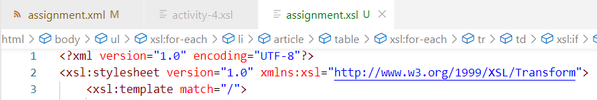

Thought process for assignment.xml:

First we write the xml declaration and xsl beginning code with URI and then write the first xsl template which will match to the root element of our xml code. 

Then we begin writing our html code which will help in structuring our xml data the way we want. So we write html tag and then the body tag

Then we start writing our code which will render the catalog according to the instructions given in the assignment.md file. Therefore, we declare Catalog in h1 tags and then start our unordered list for the items inside Catalog tag. We write that using the for-each loop and select the catalog tag so that all its children get selected, which was just one in this case. Then we write the li tag so that every output of the loop gets in one of those tags. 

All of the content in li tag is wrapped in article tag and then we select the value of product_id attribute inside product tags and put them in h3 tags. The value of description attribute is put in the p tags. Then we define a table tag as well and the first row has the table headings as defined in the document. The next rows of that table are generated from the tags inside catalog-item, which is inside product tag. So we use the for-each loop and place all the output inside a tr tag. 

Now we place the value of item_number and price inside their own td tags and the third column in the table is for gender and we need to tweak the output in this case, so we use xsl:if to see if the attribute's value is Men or Women and then write just M or W respectively. 

The next 4 columns are for sizes and here we need to embed tables in those columns. First we write an if condition to test if the value of description attribute of size tag has the value which matches with the column heading. Then we generate the table with columns color and image and then use a for-each loop to write the respective values in new rows, just like what we did previously. We repeat this for the next 3 columns as well and then write all the closing tags and end the xsl document.
