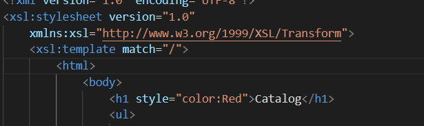
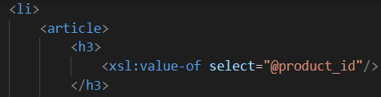
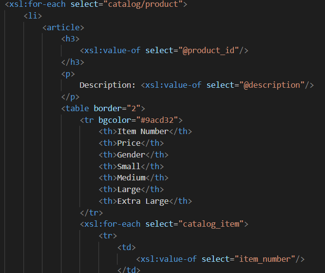
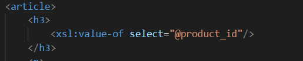
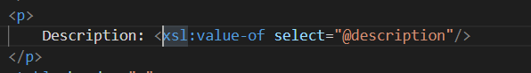
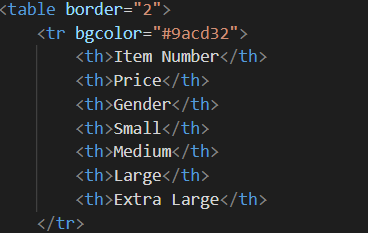
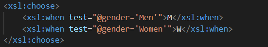
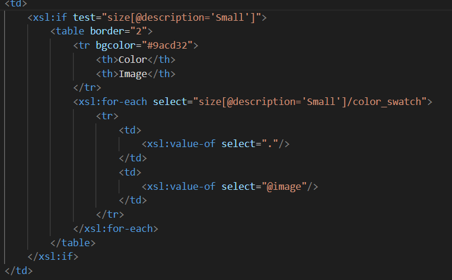
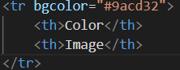
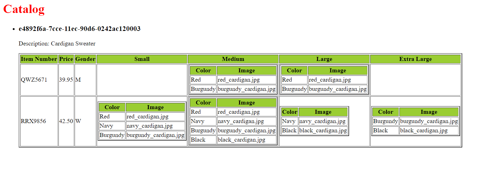

# Assignment

1. Open `module-4/assignments/assignment.xml` in your editor
2. Create xsl file and add link to it
<?xml-stylesheet type="text/xsl" href="assignment.xsl"?>

3. Display catalog in the following way

- main title is "Catalog"

- use html list tag to display catalog

- render each item as `<article>` inside list item tag

- display product id as h3

- display product description as paragraph

- render table of catalog items with columns: item number, price, gender, small, medium, large, extra large (if column item is not present in item, then display empty cell)

- for gender column render M for Men, W for Women

- inside size columns (small, medium, large, and extra large) display subtable with 2 columns: color and image

Create `module-4/assignments/assignment_YOURNAME.md` and explain your thought process in it. Add screenshots of each step to the file (Refer `week-1/assignments/evaluation-1.md` on how to add image to md file)

Ans.
So, the first requirement was main title should be catalog so I used h1 tag. Secondly, we needed list tag to display catalog so I used li. Since, every item needed to be rendered as "Article" inside the list tag so I added <article> tag inside <li> and added items inside the block. The next thing I did was to display the product id as h3 which was "e4892f6a-7cce-11ec-90d6-0242ac120003". After that, we needed to display Description as paragraph so I use 
 tag. Furthermore, we had to render each Item under <article> tag which includes table for the content catalog items with columns: item number, price, gender, small, medium, large, extra large.For gender I took M for Male and W for Women by using . If the size was present then it had to be displayed using subtable with 2 columns one for color and another for Image like . All of these generated the following output: - 
