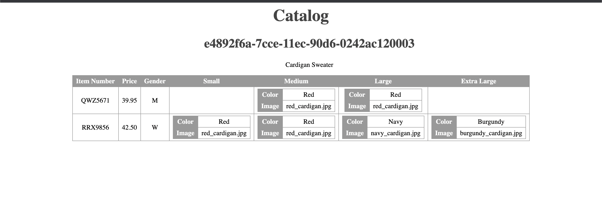

# Assignment

The parent node 'Catalog' is displayed using h1 tag.
A for loop is used to fetch 'Product' node, which is a child node of 'Catalog'. It's attributes are displayed using h1 and p tags.

