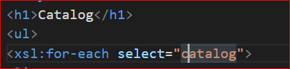
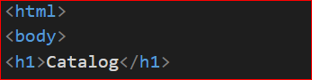
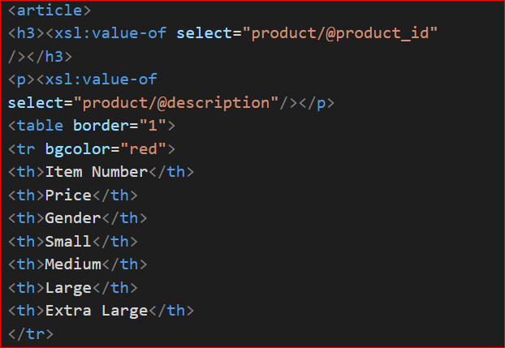
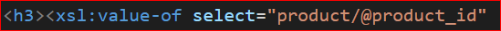
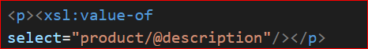
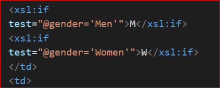
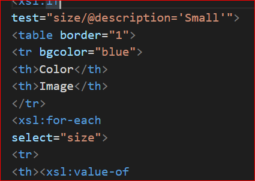
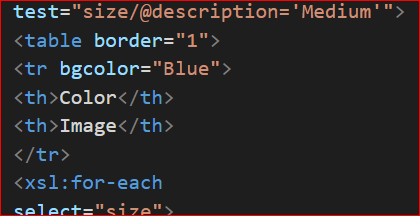

We gave the title as CATALOG as in the screenshot

we have used the html tag to display the title CATALOG

render each item as `<article>` inside list item tag

display product_id as h3

display product description as paragraph

for gender column we refer M for Men andW for Women

size columns inside (small, medium, large, and extra large) two columns in the display subtable: colour and image