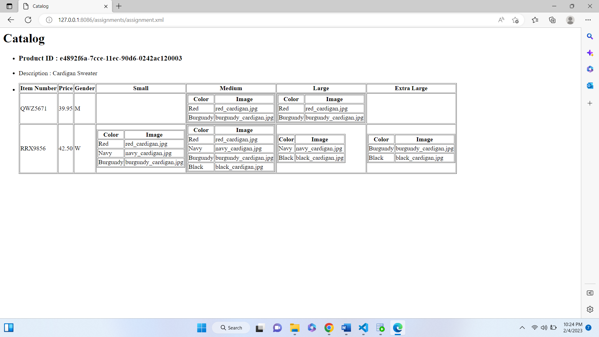

# Assignment

1. Open `module-4/assignments/assignment.xml` in your editor
2. Create xsl file and add link to it
3. Display catalog in the following way

- main title is "Catalog"
- use html list tag to display catalog
- render each item as `<article>` inside list item tag
- display product id as h3
- display product description as paragraph
- render table of catalog items with columns: item number, price, gender, small, medium, large, extra large (if column item is not present in      item, then display empty cell)
- for gender column render M for Men, W for Women
- inside size columns (small, medium, large, and extra large) display subtable with 2 columns: color and image

Create `module-4/assignments/assignment_YOURNAME.md` and explain your thought process in it. Add screenshots of each step to the file (Refer `week-1/assignments/evaluation-1.md` on how to add image to md file)

We start my creating the xsl file and adding the stylesheet and template tags. Then we link it to the xml file using xml style sheet. Then as we want 'Catalog" in the title we use the head tag we then move on to the list tag and include article tag inside it since we want to put the catalog items in the article tag. Then we traverse through catalog/product -> then we get attributes of product_id , description. Then we for the table for item number, price, gender, small, medium, large, extra large. First row will contain the clumn names. Then we move on to the item number and price in the second and thirs column with their respective values populated in the rows throw for each. Next is the gender column so we use the if statement to put M for men and W for women. Then we move on to the subtables for each sizes. each column will have a subtable with men and women in the respective rows. In order to speperate the description of the sizes we first use the if tags for the sizes and then for each to traverse through color swatches and poplate the color and images columns of each sizes respectively. since we are checking for size descriptions before populating the columns with no infrmation in a partivular section will remain empty.we go in the order given i.e. small, medium, large, and extra large and populate the rows and then move to the next column.
