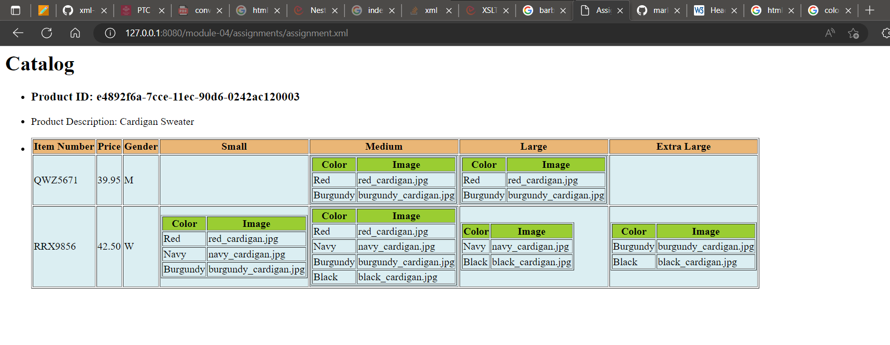

Steps:

1) The title Catlog is displayed using h2 tag of html.
2) The Product is added using xsl:for-each inside list tag which consist of 1 item.
3) The product_id is displayed using article tag with using the attribute "product_id".
4) Similarly product description is displayed with attribute "description".
5) Added a table with all fields.
6) Created for-each loop to add all the rows.
7) Inside each row use the xsl:value to display the data.
8) Create a choose for the gender for Men is "M" and Women is "W" using xsl:choose and xsl:when which allows to select one of the 2 choices and display the result.

9) The size column are assigned to columns .

10) Added table with 2 columns color and image.
11) xls:if is used to check that if the valueis not present it should return empty column.

