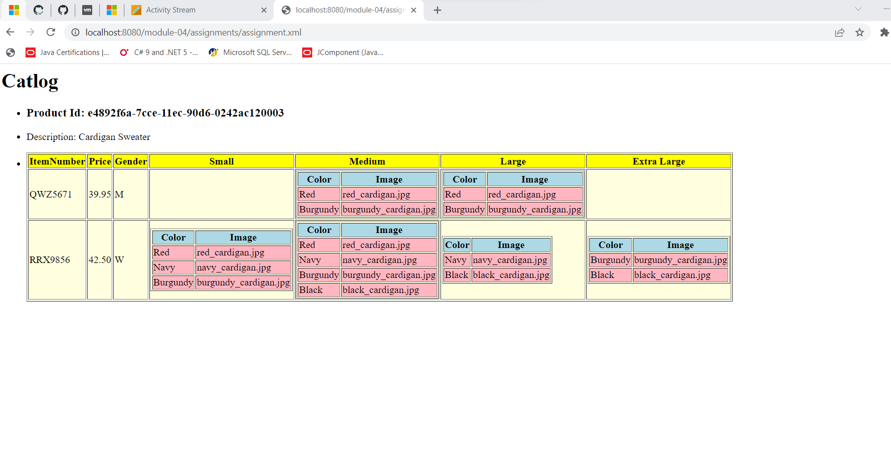

I make new xsl file then i link this xsl file with xml file.

code for xsl file:(assignment.xsl)
first line is always xml declartion.
for designing code written into html tag.
step 1- Main title is catlog so i wrote catlog in h1 tag.
step 2- Then all items wrote in UL (unordered list).
step 3- Then i wrote for each loop for product tag in catalog tag because I think that one catlog has multiple products.
step 4-Then li is used for list items so every tags written into li tag.
step 5 -Then all items wrap into artical tag
step 6- First item is product id, which written into h3 tag. It is attribute of product so i wrote @ in select.
step 7- Second item is description, which written into p tag. It is also attribute of product.
step 8- Then for display all items sub tag i used table
step 9- In first row of table i wrote using tr and it has all title of columns using td like item number, price..
step 10-Then i used for each loop for catlog_items because in one catlog there are multiple catlog_items.
step 11-Then item_number and price are simple tags so i wrote using select.
step 12-For Gender i wrote choose statment that if it values is male then write m and it female then write f.
step 13-Now next row is for small size products.So i wrote if condtion that display size of products but which description is small.
step 14- In if, i again wrote subtable with color and image. For values of this rows color is elemeny value so i wrote text() and image is attribute value.I wrote this into foreach loop because there are multiple items which has small size.
step 15- Then setp 14 is repeat for medium, large and extra large items.I just changed if condition and foreach loop for this.

