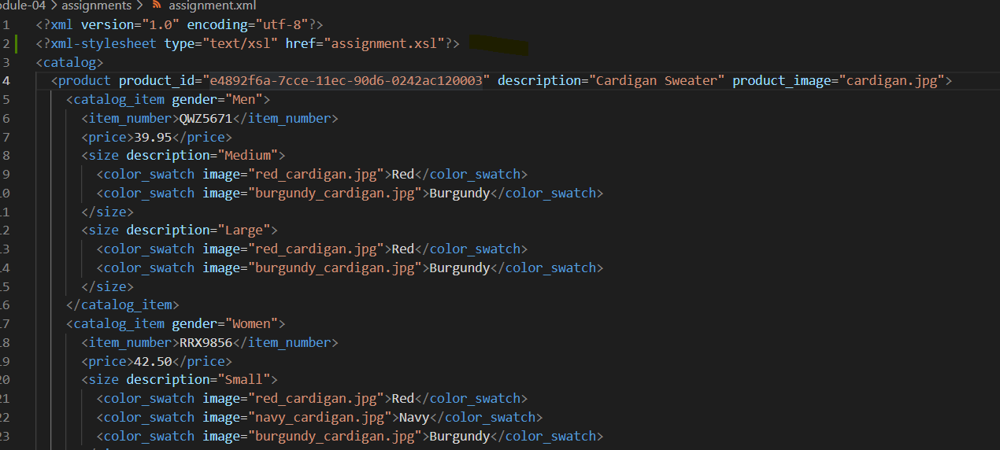
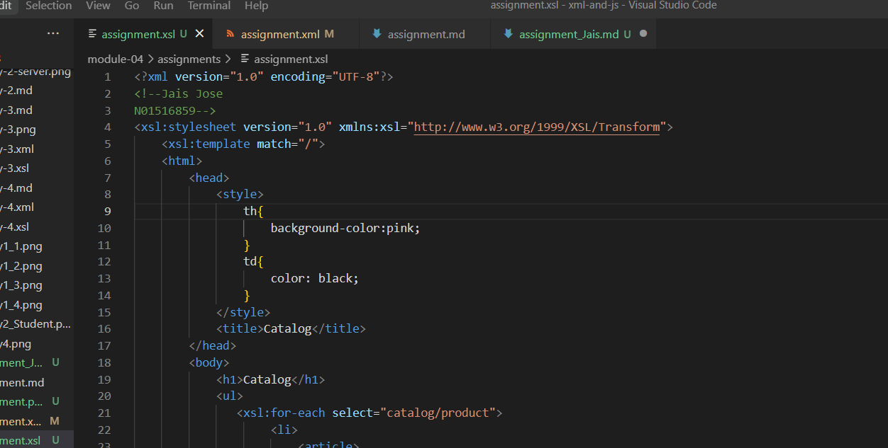
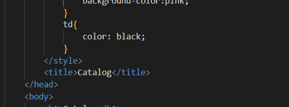
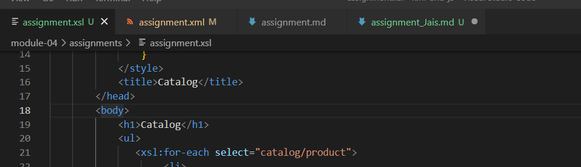
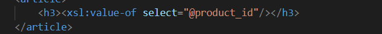
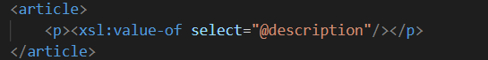
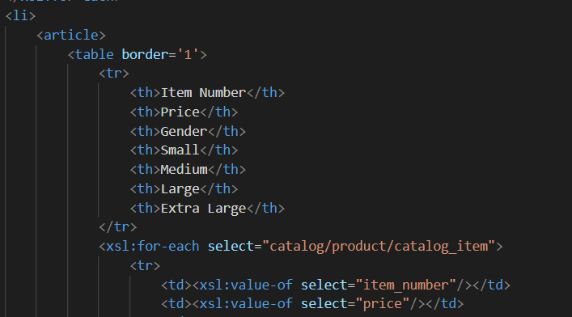
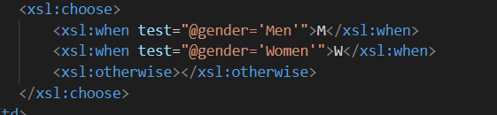
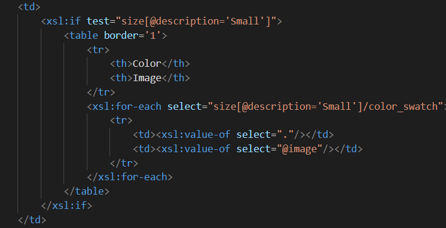

# Assignment

1. Open `module-4/assignments/assignment.xml` in your editor

2. Create xsl file and add link to it

3. Display catalog in the following way

- main title is "Catalog"
Here I added the Catalog in the title tag

- use html list tag to display catalog
Here I have used unordered list tag which display every element of catalog.

- render each item as `<article>` inside list item tag
Here every element of the catalog is displayed using the li tag. All the items inside li is under atricle tag 

- display product id as h3
Here the product_id attribute is from the product element and displayed it in h3 tag

- display product description as paragraph
Here the attribute description is taken from the element product displayed it in p tag as below.

- render table of catalog items with columns: item number, price, gender, small, medium, large, extra large (if column item is not present in item, then display empty cell)
Here all the header row contains with all the above names as coloumn names. Following rows displays related data to the corresponding title.
Also there is a check if any data is not available then display it as NULL i.e. blank

- for gender column render M for Men, W for Women
Here I have used the tag xsl:choose which will determine  wether to choose M or W according to the value of gender and display it accordingly.

- inside size columns (small, medium, large, and extra large) display subtable with 2 columns: color and image
Inside every size column there would be 2 more columns containing color and image columns.It will display proper data based on the size 
of the catalog items else if there is no data then it will display as an empty cell.

Create `module-4/assignments/assignment_YOURNAME.md` and explain your thought process in it. Add screenshots of each step to the file (Refer `week-1/assignments/evaluation-1.md` on how to add image to md file)
This is the final output.

