# Module-04 Assignment

- main title is "Catalog": 
I displayed the main title "Catalog" as h2 tag. 
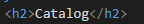 

- use html list tag to display catalog: 
I created an unordered list with 3 list items to display the catalog. 
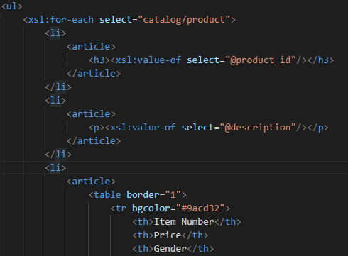 

- render each item as `<article>` inside list item tag: 
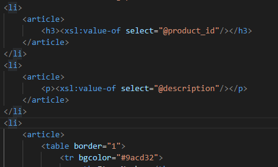 

- display product id as h3: 
I display the product id as h3 by using `<xsl:value-of>` tag and select "@product_id"  
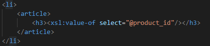 

- display product description as paragraph: 
I display the product description as paragraph by using `<xsl:value-of>` tag and select "@description"  
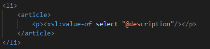 

- render table of catalog items with columns: item number, price, gender, small, medium, large, extra large (if column item is not present in item, then display empty cell): 
I created a table of catalog items with columns, used `<xsl:for-each>` tag to  apply a template repeatedly for each node, and used `<xsl:value-of>` tag to display the value of item number, price, gender, small, medium, large, extra large in differents columns.  
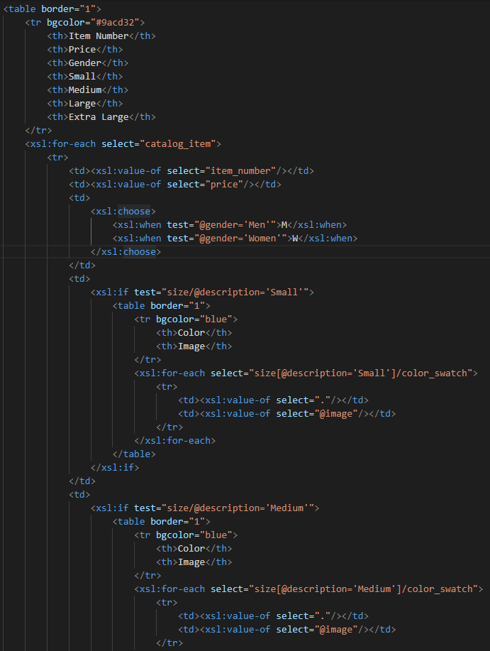 
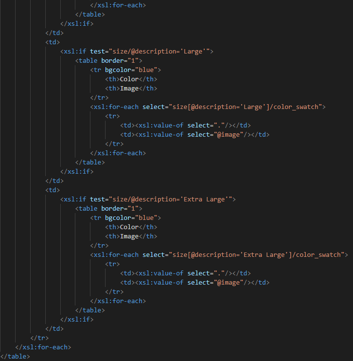 

- for gender column render M for Men, W for Women: 
I used the `<xsl:choose>` tag to display M for Men and W for Women. 
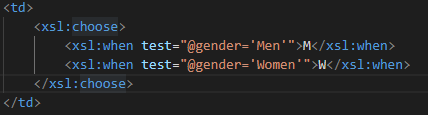 

- inside size columns (small, medium, large, and extra large) display subtable with 2 columns: color and image: 
I used the `<xsl:if>` tag to specify the size columns and create subtable in the size columns. Each subtables would have 2 columns "color" and "image". I used `<xsl:for-each>` to apply a template repeatedly for each node and used two `<xsl:value-of>` tags to select the values of "@image" and color_swatch by using the Syntax "." (for selecting the current node).  
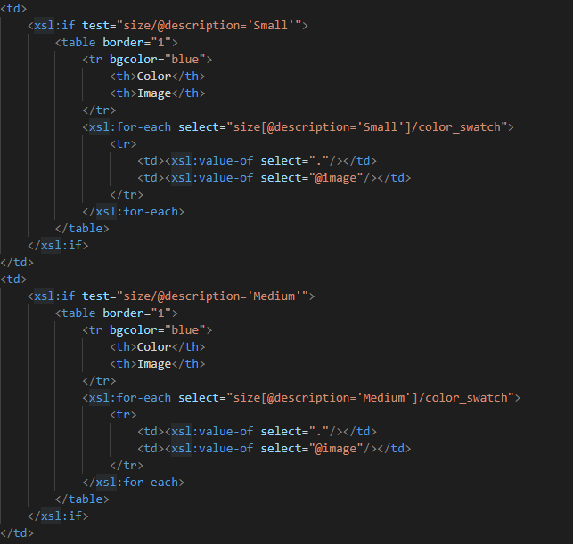 
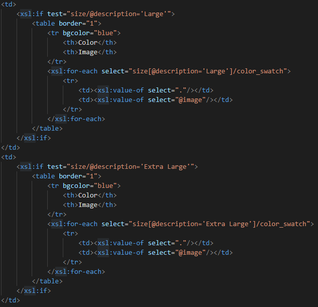 

- Final outcome: 
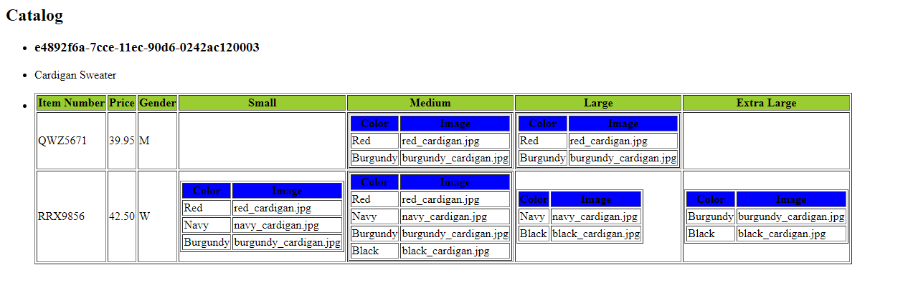 