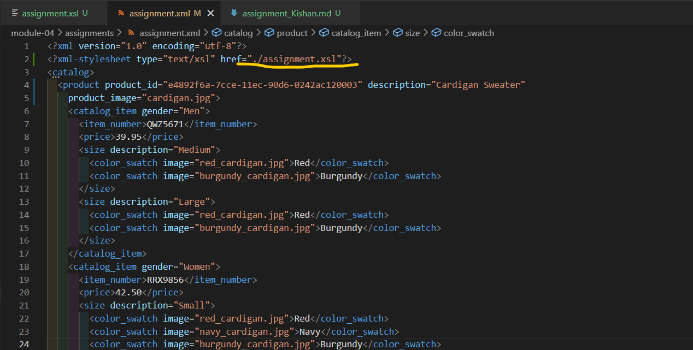
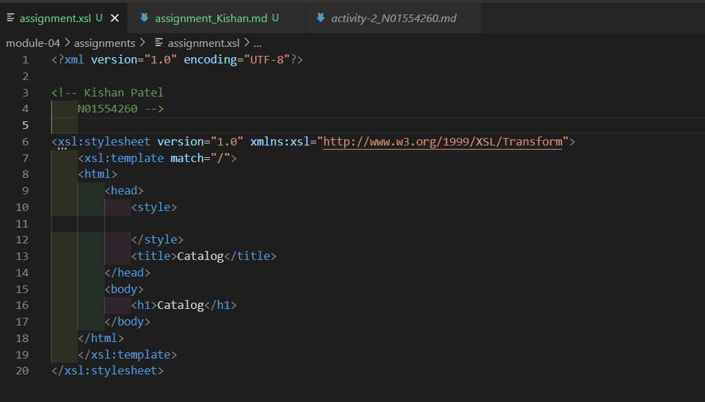
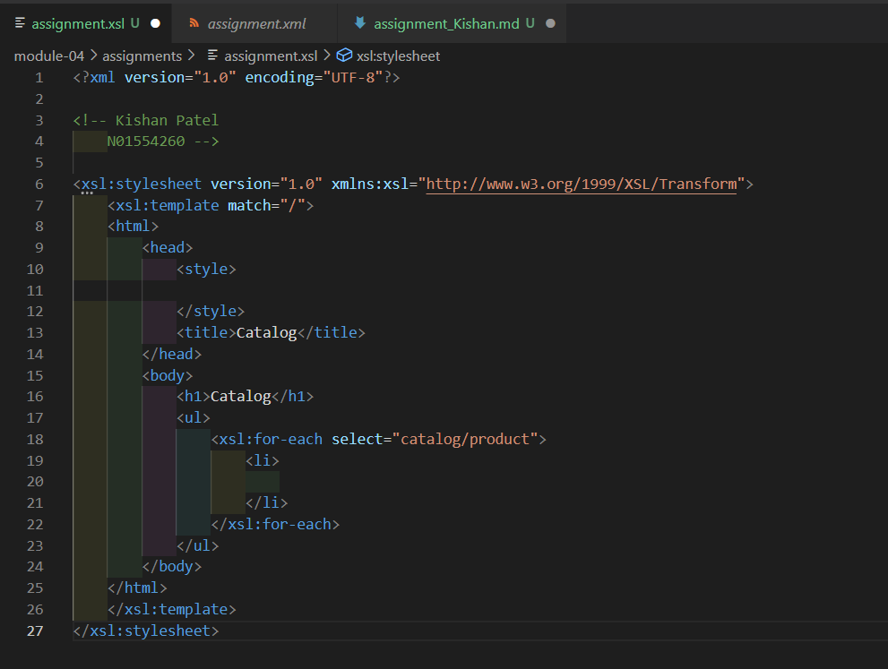
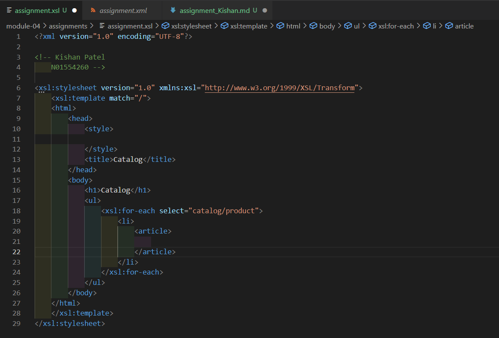
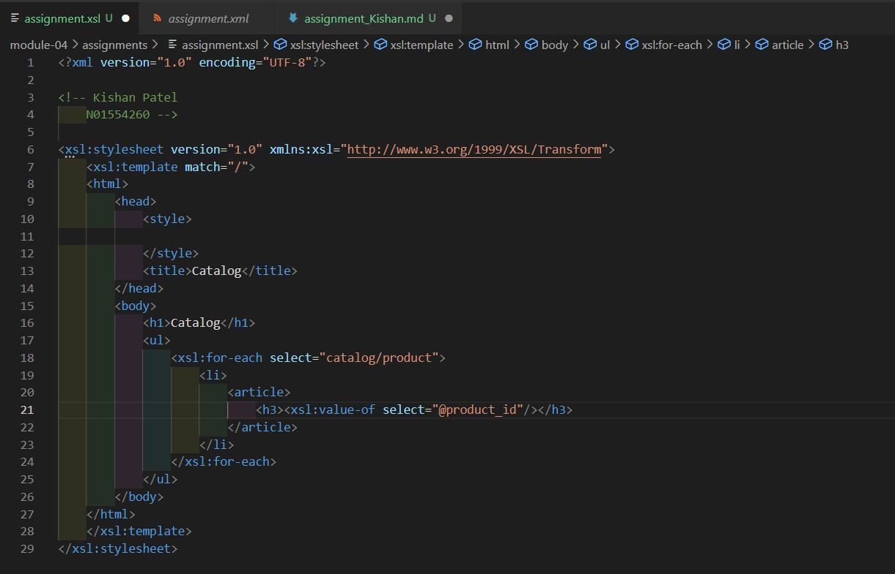
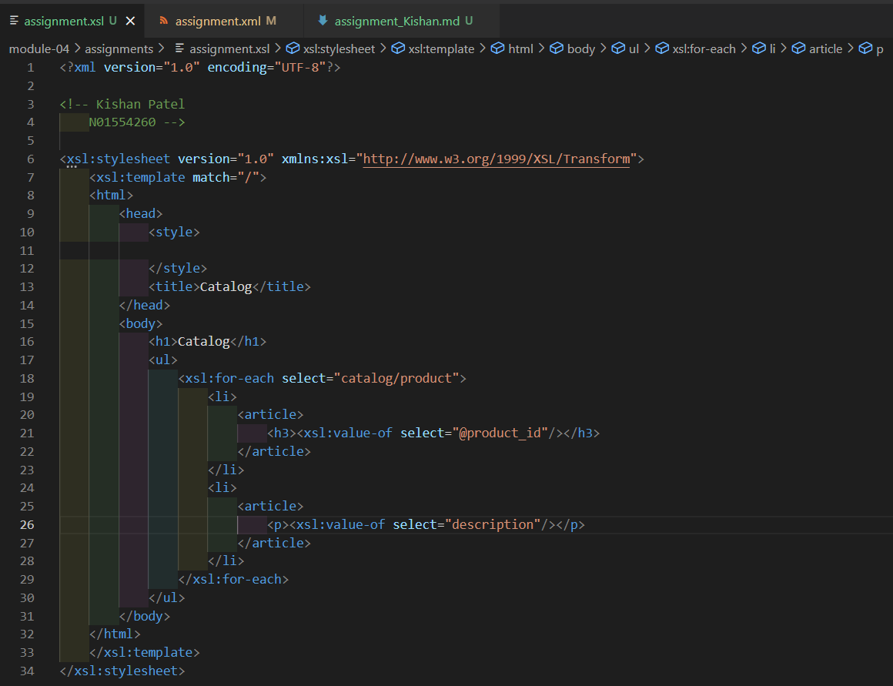
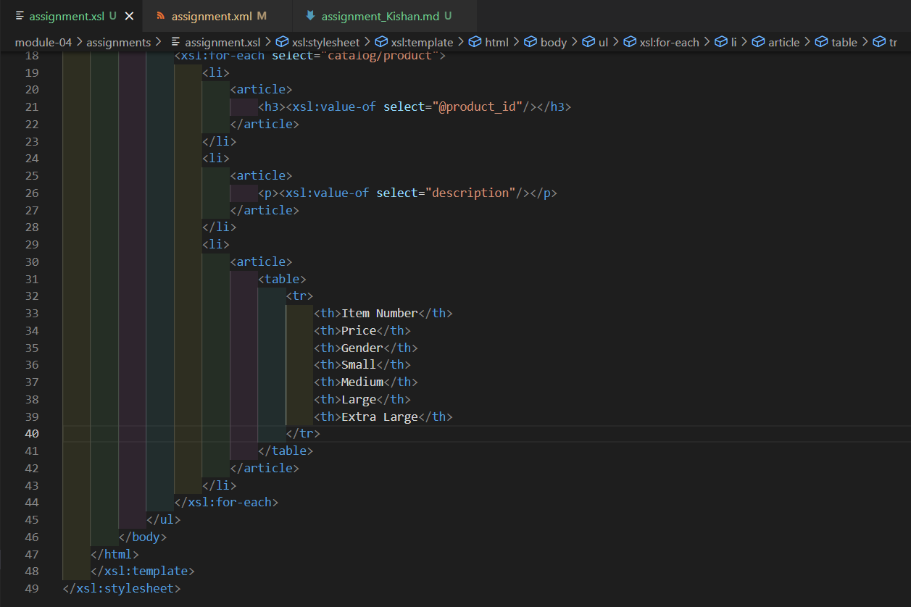
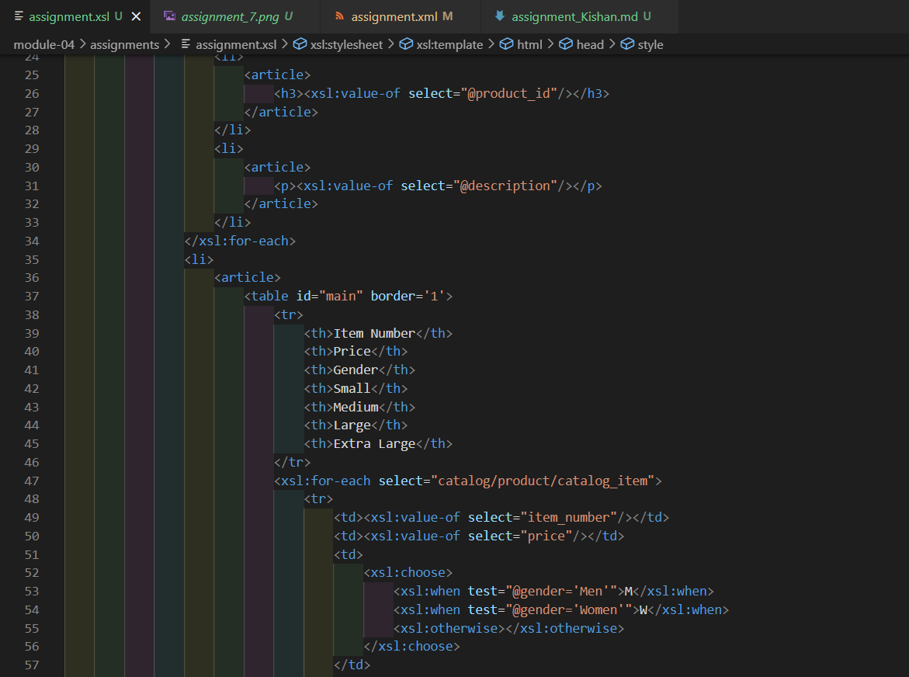
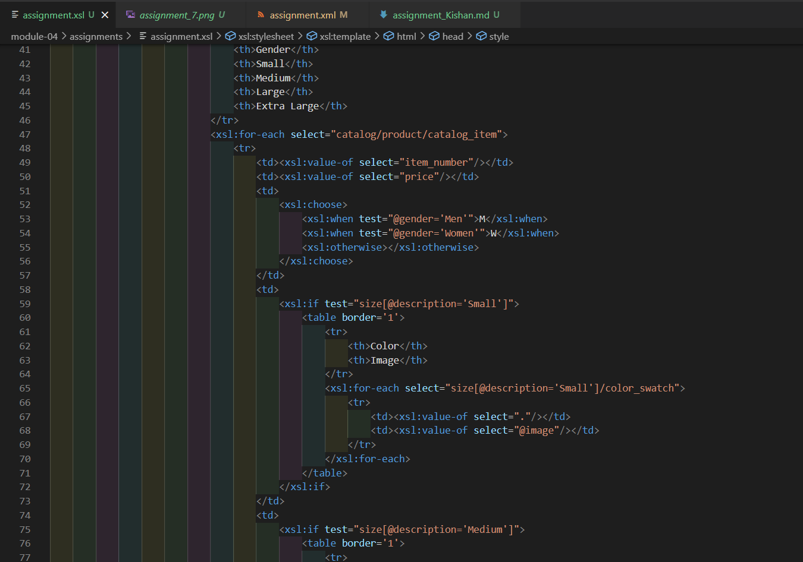
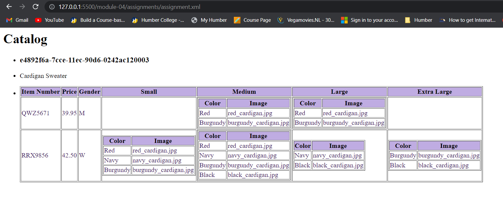

# Kishan Patel

# N01554260

1. Open `module-4/assignments/assignment.xml` in your editor

2. Create xsl file and add link to it

   

3. Display catalog in the following way

# main title is "Catalog"

-> Here, we are supposed to add the "Catalog" in title tag in `head` tag and also in
h1 tag in body to distinguish the main or root element here.

# use html list tag to display catalog

-> In this part, we are supposed to use unordered list tags to represent every element of catalog using `li` tag.

# render each item as `<article>` inside list item tag

-> All the content or items inside each `li` should be under an `article` tag like this image.

# display product id as h3

-> Here, we are required to get the product_id attribute from product element and display it
in a `h3` header tag.

# display product description as paragraph

-> Here, we are required to get the description attribute from product element and display it
in a `p` paragraph tag.

# render table of catalog items with columns: item number, price, gender, small, medium, large, extra large (if column item is not present in item, then display empty cell)

-> In this step, we are required to make a header row containing the given headings as column title and
the following rows that contain related data to the column title. Also, here we are checking if there is any
data in that column or not. and if not then display an empty cell for it.

# for gender column render M for Men, W for Women

-> Here, we have used `xsl:choose` to determine whether to use M or W according to the value of
gender attribute of the catalog_item and display it accordingly.

# inside size columns (small, medium, large, and extra large) display subtable with 2 columns: color and image

-> Inside every size column, there will be a table containg 2 columns color and image and will
display appropriate data based on the size form the cataog_items and if there is none, then will
display an empty cell.

# OUTPUT::

