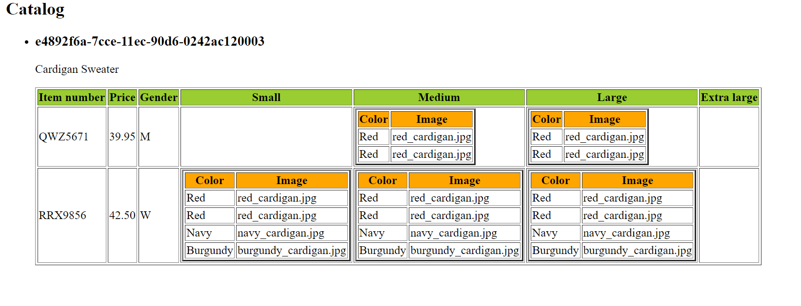
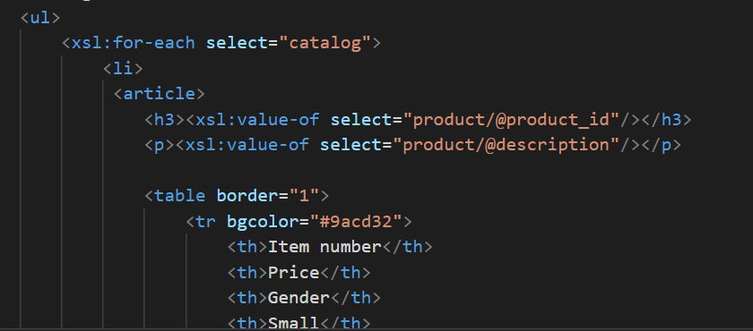
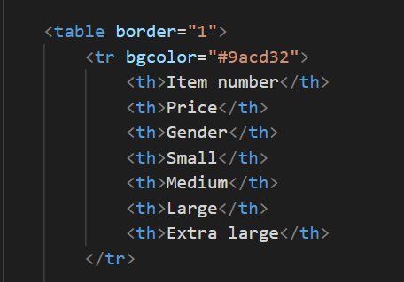
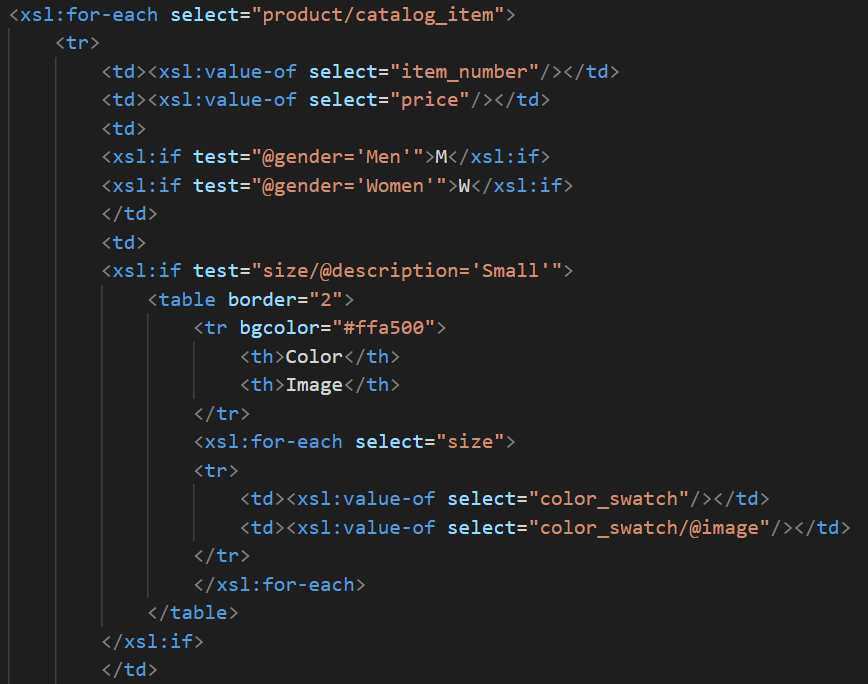

- Output

I use `<ul>` tag to create a list for each catalog item and use `<article>` tag to render each item inside the list
I display product id with `<h3>` and display description using `
`

Set up the column names for the table

For each `<td>`, I use `<xsl:value-of>` to get the values.
I use `<xsl:if>` to test for gender, assigning M for Men and W for Women
I also use `<xsl:if>` to obtain value from different conditions (size: small/ medium/ large/ extra large)
Within `<td>` of each size, I create a table with columns named color and image. I also use `<xsl:for-each>` and `<xsl:value-of>` to get the corresponding values
