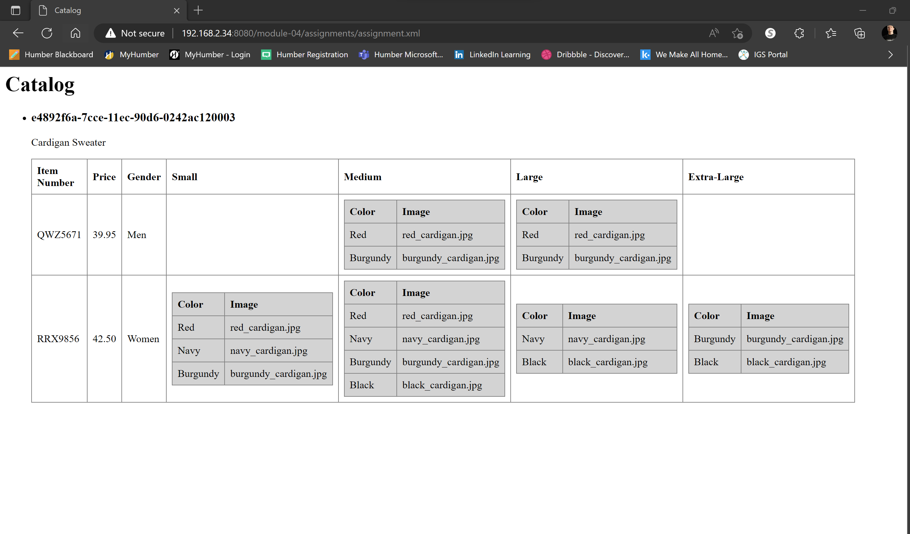

## Assignment - module04
## Leon Czarlinski - n01541167

2. Create xsl file and add link to it
 

3. Display catalog in the following way
 
 

4. Explain your thought process in it
 - [X] It was hard to understand what was asked in the first place. I am more like a visual person, so I draw a scheme before starting to code
 - [X] It was a little bit hard to validate the XPath
 - [X] It was a little bit consfusing when to use <!-- <xsl:for-each> --> and <!-- <xsl:value-of> --> but I think I got it
 - [X] It demands practice to get all the concepts
 - [X] When you get deep into the code, It can be confusing, specially when we have to do "ul/ol > li", "table > tr > th" and "table > tr > td"
 - [X] To help understand the structure I did a cascate scheme:
    <!--
    <catalog>
    <product>
        <catalog_item>
            <item_number>
            <price>
            <size>
                <color_swatch>
                <color_swatch>
    -->
