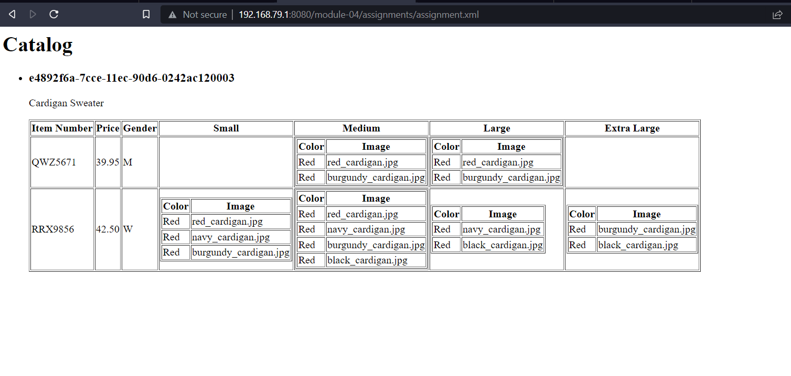

OUTPUT -->  

<xsl:template match="/">
        <html>
            
            <body>
                <h1>Catalog</h1>

                <ul>
                    <xsl:apply-templates select="catalog/product" />
                </ul>
            </body>
        </html>
    </xsl:template>

As shown above, the template for catalog is set, however catalog consists of product which is a complex element (in context of xsd) hence wew have to  make a seperate template for product.

<xsl:template match="//product">
        <xsl:for-each select="//product">
            <li>
                <article>
                    <h3>
                        <xsl:value-of select="//@product_id" />
                    </h3>
                    

                        <xsl:value-of select="//@description" />
                    

                    <table border="1">
                        <tr>
                            <th>Item Number</th>
                            <th>Price</th>
                            <th>Gender</th>
                            <th>Small</th>
                            <th>Medium</th>
                            <th>Large</th>
                            <th>Extra Large</th>
                        </tr>
                        <xsl:apply-templates select="//catalog_item" />

                    </table>
                </article>
            </li>
        </xsl:for-each>
    </xsl:template>

Here, as per question, the product_id and description are displayed in h3 and new paragraph under article tag and a general headings for the table is set. However, the content which goes inside this table is in catalog_item which again is the complex item.

In the rest of the part, the same cycle goes on if there comes any complex element, then a seperate template is made for it followed by some <xsl:if> tags which are used to filter out the desired format of output as per the question. For-eg: M for Men W for Women.

