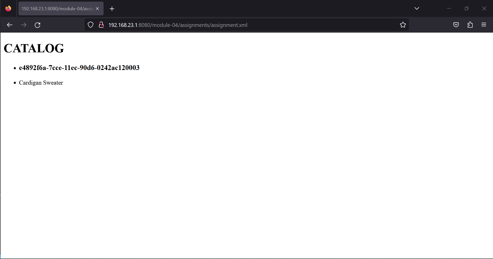
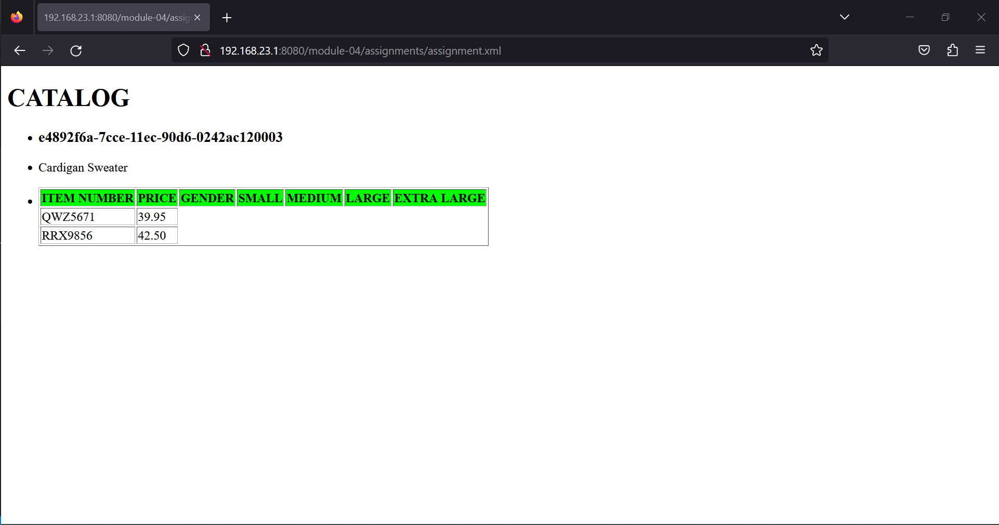
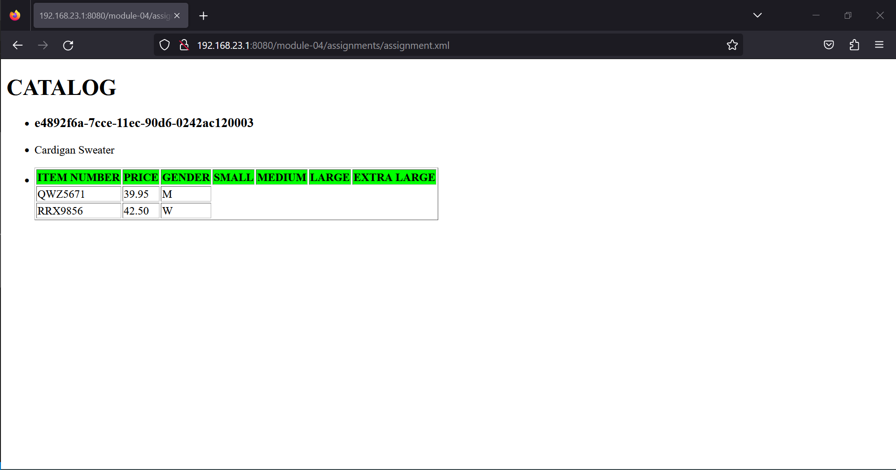
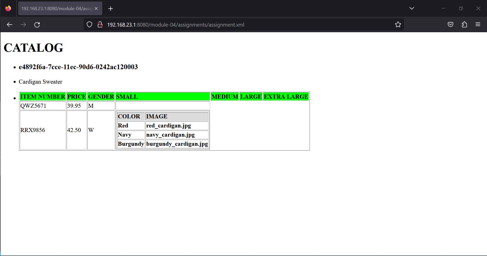
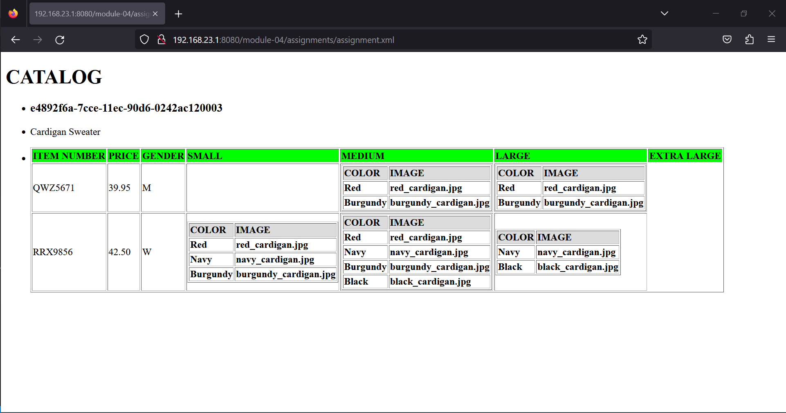
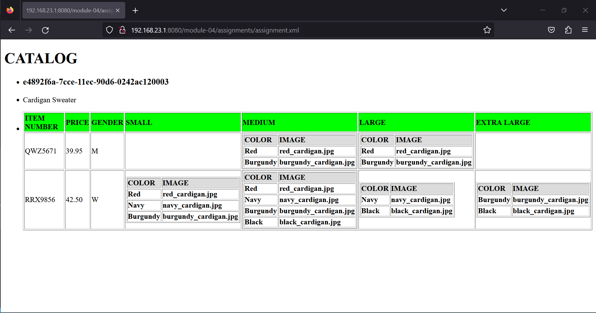

# STEP 1
1. Just folowing the basic specifications given to display main title, the "product ID" & "description" of the product,using <xsl:for-each> tag.

# STEP 2
2. Setting up the layout for the tableand setting the header order to display the info in it. Then using <xsl:for-each> tag so that it applies the node repeatedly. Testing it using basic vales such as "item number" & "price".

# STEP 3
3. Using the <xsl:choose> tag for the if-elselike condition to just display the initial of M and F instead from Male and Female from the gender attribute.

# STEP 4
4. The most tricky part was the creation of subtable in a column. Firstiwas trying hard with colspan attribute but it was not working at all. Tried doing the way we create table but first appying the conditional test. It was failing for while doing with the colspan attribute on <th> tag of parent table, and again using <tr> & <td>. But when another table was created after the conditional test and giving it'sown independent <th> and independent iteration on child elements of parent element "size" for getting values from chile element of "size" attributes. It suddenly showed "ERROR PARSING XSL STYLESHEET". But surprisingly on last attempt,it worked.

# STEP 5
5. Then tried did copy paste entire block and doing some minor changes, got positive results.

# STEP 6
6. Did add bgcolor attribute to <tr> tag for coloring the header element of table so taht they stand out and make data reading quite easy.
FINAL OUTPUT = 