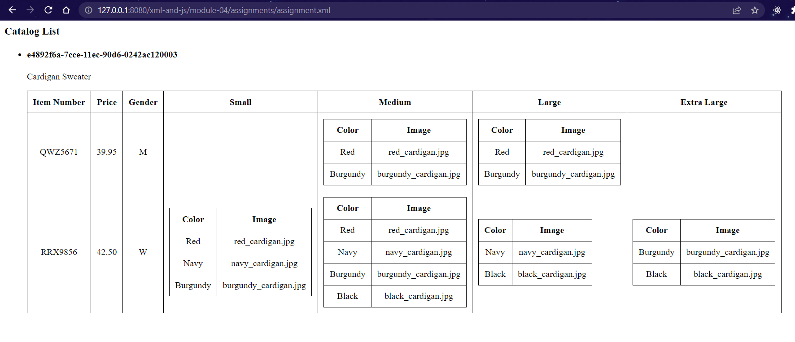

# Ronak Mangroliya - N01530634

2. Create xsl file and add link to it
 

3. OUTPUT:

4. Explain your thought process in it
--> At the first, it's a bit confusing for me but what i understand as of now is the XML is about the store the data structured format and on the other hands, the XSL language for transforming XML documents into visual format.
--> for example, into a human-readable format such as HTML.
--> XPath os all about addressing parts of XML documents
--> The first part of the template structure is more about the html. you can find title and body section there. you can also define yout style section inside it.
--> The second part is more about the detail of the template structure. so when the pattern is matched in the source, the corresponding pattern is generated in the result.