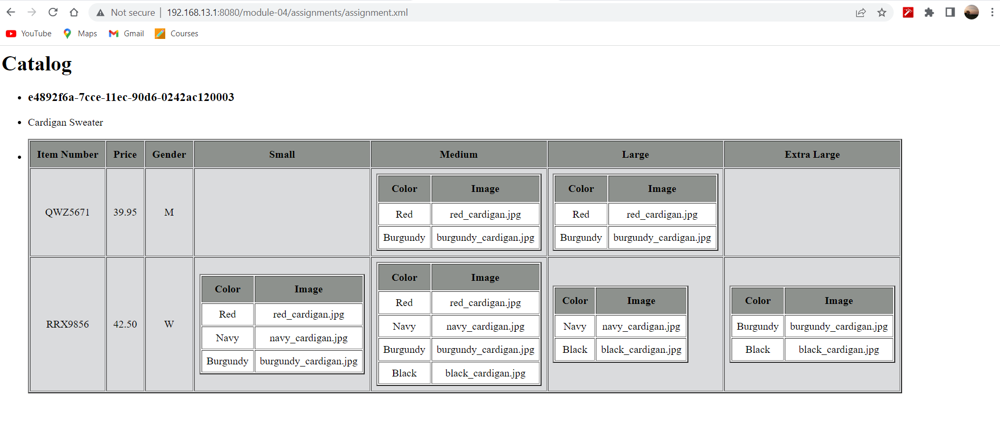

-- For the main title "Catalog" I have used h1 tag. 
-- To display the products in the catalog I have used <ul> list.
-- As instructed I have used <article> tag inside the <li> tag. The <article>  tag makes the content independent from the other content.
-- Used <h3> tag for product id and 
 for description. 
-- used <table> tag to display the table and <th> to define the header of the table. <tr> tag is used to define the row elements and <td> tag is used to define the data in a cell. 
-- I have used <xsl:for-each> to iterate through the particular element.
-- <xsl:if> is used to specify the condition, if the condition is satisfied the mentioned block will be executed.
-- to render M for men and W for women, I have used the <xsl:choose> and <xsl:when> which is similar to a switch case.
-- Used embedded CSS to add css properties. 

Output
