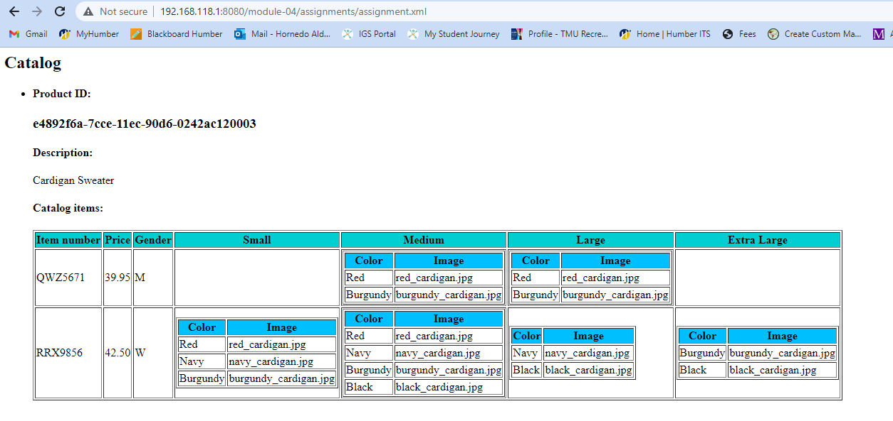
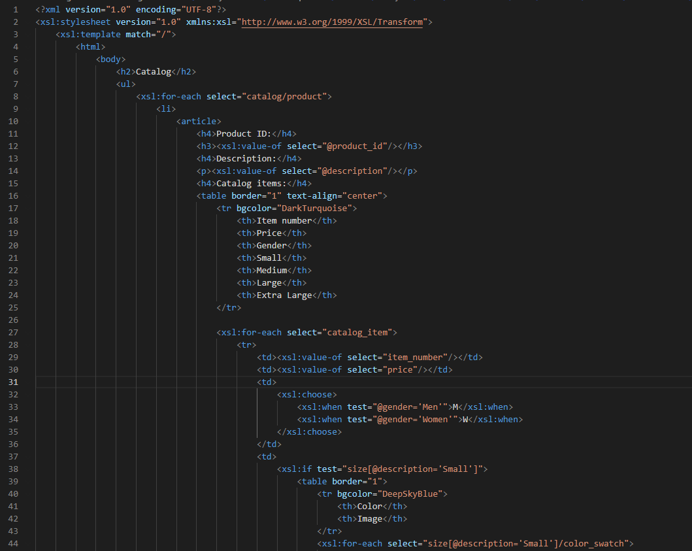
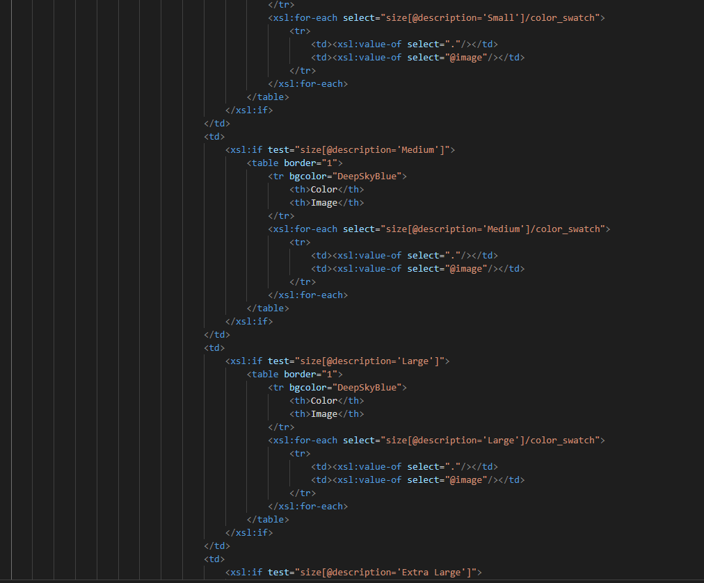
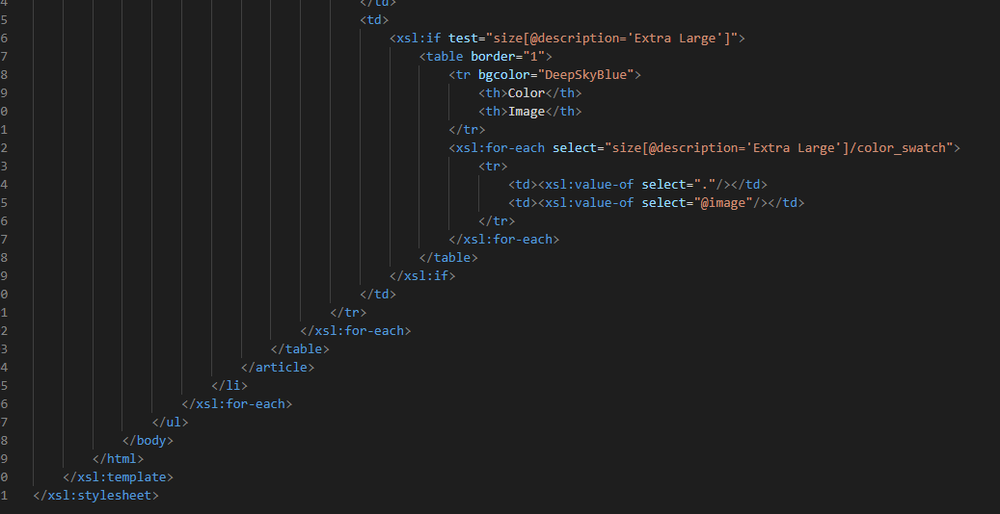

# Assignment
First of all, to maniulate my XML data, and transform it into an html I defined my themplate to match the rood element. To comply with the html requirements in the assignment I used html structures from my previous course, but when it gets interesting is to use the XPATH expressions. It helped me to try to look at it as a tree or a hierarchy, where one element comes from another. then when I can have more than one element I thought of "xsl:for-each" to loop over elements in the XML data, If I wanted to extract the text data from the elements I used "xsl:value-of", and "xsl:if" to conditionally include or exclude content based on certain conditions. The resulting HTML document contains a table that displays information about products in a catalog, including product IDs, descriptions, and catalog items such as item numbers, prices, genders, in tables and sub tables for the sizes which inlude and color and image.

