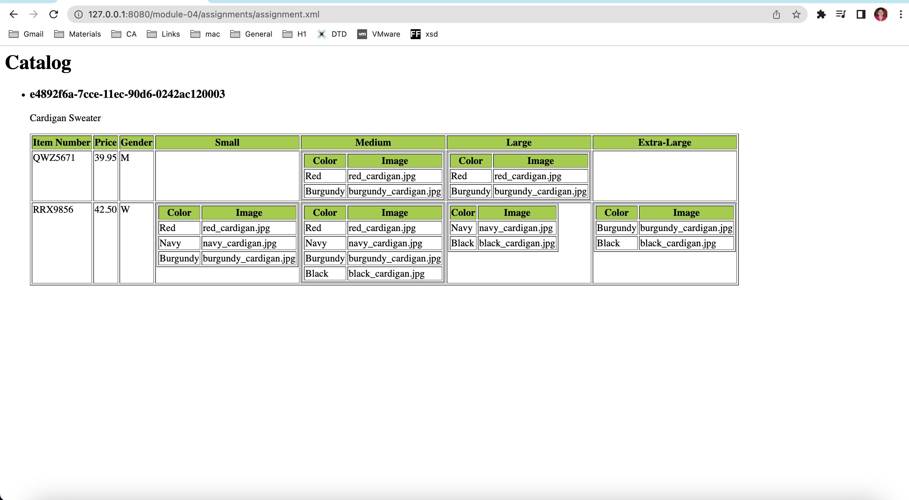

# Assignment

Create xsl file and add link to it
assignment.xsl file is creted and linked to assignment.xml

Display catalog in the following way

Thought process:
XML does not have predefined tags, and therefore the meaning of each tag is not well understood.
XSL describes how the XML elements should be displayed.XSLT uses XPath to find information in an XML document. XPath is used to navigate through elements and attributes in XML documents.
In the transformation process, XSLT uses XPath to define parts of the source document that should match one or more predefined templates. When a match is found, XSLT will transform the matching part of the source document into the result document.

XSLT Elements used:
xsl:template : xsl:template element defines a template. Templates are used to transform the XML data into an HTML document.The match="/" attribute associates the template with the root of the XML source document.
xsl:for-each :This tag applies a template repeatedly for each node. Here there are 2 such tags. one for matching the "product" element and another for matching the "catalog_item" element. The first tag generates a list of items for each of the product element in the XML and displays its product_id and description. 
The second tag generates a table for each of the catalog_item element and its displays item_number, price, gender, and size(small,medium,large,extra large).
xsl:value-of:This element is used to extract the value of a selected node and add it to the output stream of the transformation.
xsl:choose:This tag specifies a multiple conditional tests against the content of node elements. Similar to switch-case.

