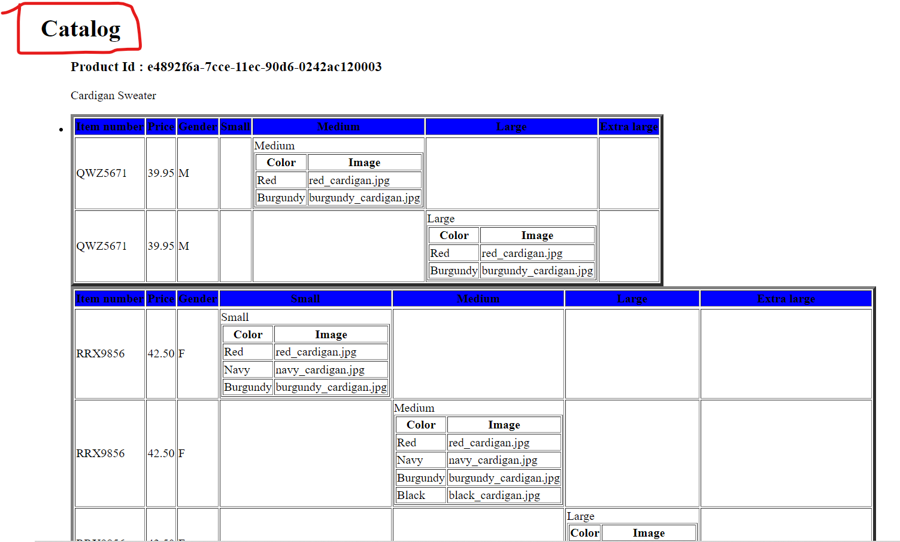
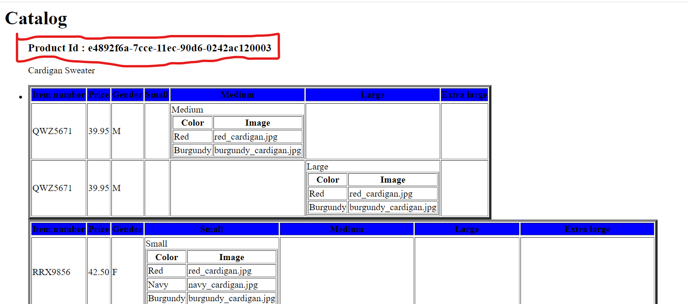
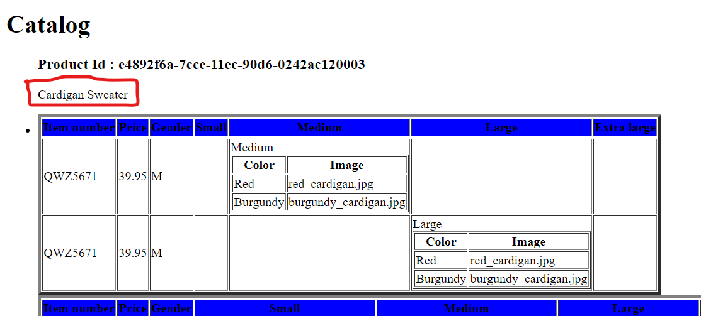
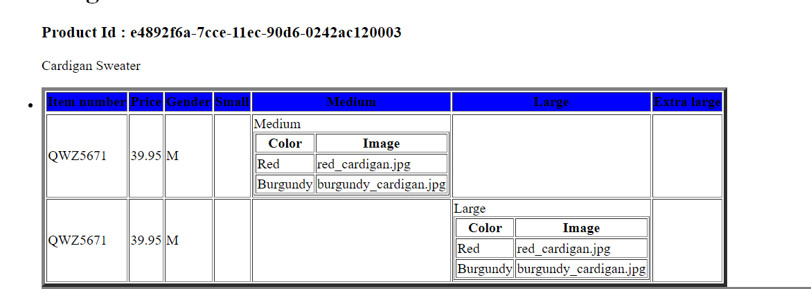
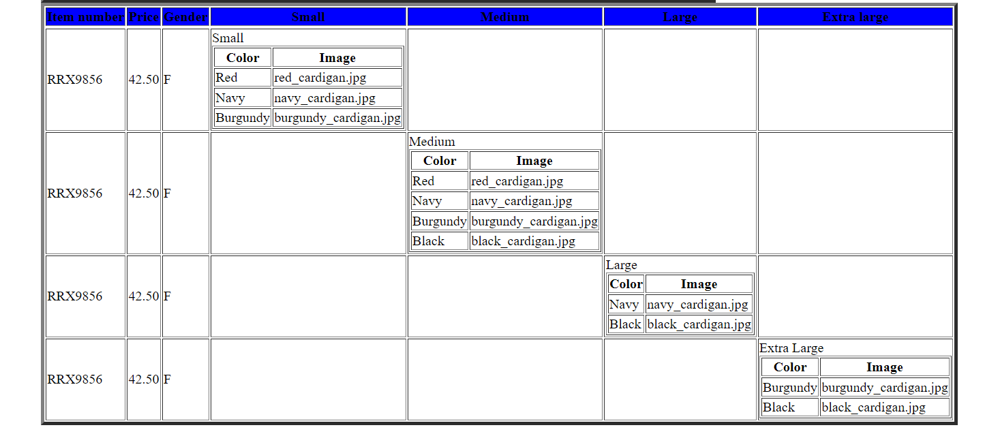

1. Main Title is "Catalog"
- Add title to the table by xsl file is "Catalog"

2. Display Product id as h3

3. Display Product Description as Paragraph
- write a paragraph in p tag

4. Table_1

5. Table=2
