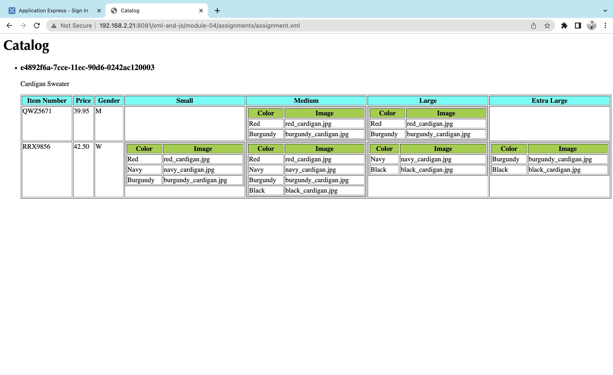

Part1:

Description:

This XSLT template is used to define the structure of an HTML document. It defines the basic structure of an HTML document, including a head section with a title and a style section, and a body section with a header and a list. 

Part2 :

The lines of XSLT code define two templates, one for matching the "product" element and the other for matching the "catalog_item" element, in the source XML document. The templates are used to transform the XML data into an HTML document. The first template generates a list item for each "product" element in the XML and displays its product_id and description. The second template generates a table row for each "catalog_item" element and displays its item_number, price, gender, and size.

Part 3 : 

<?xml-stylesheet type="text/xsl" href="./assignment.xsl"?> This is the line to link the XML file to XSLT. Add the template, value along with the condition and run the output. 
Below is the ouput snapshot.

