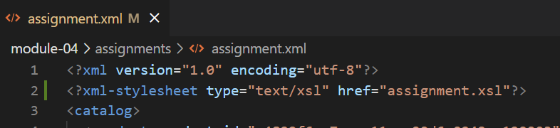
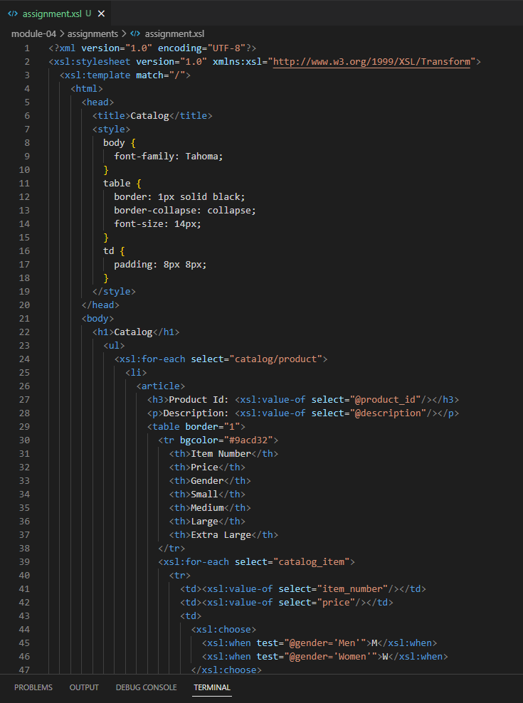
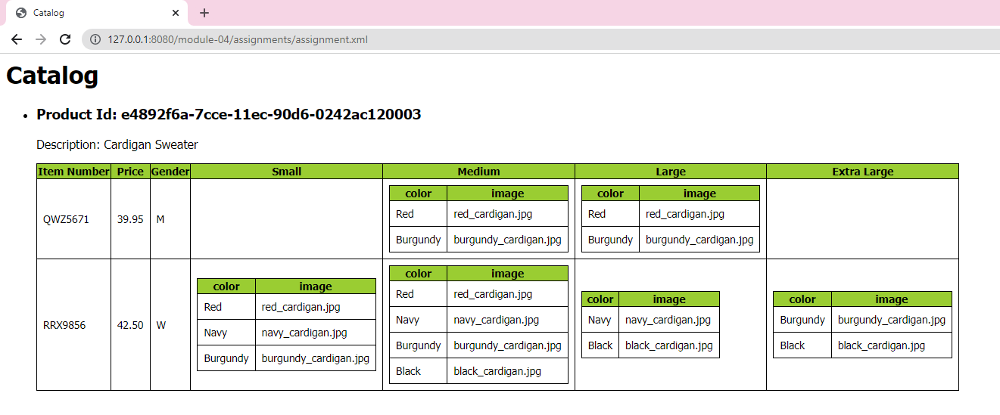

# Assignment

I defined the XSL filename assignment.xsl and linked it into the XML file following this:
<?xml-stylesheet type="text/xsl" href="assignment.xsl"?>

For the XSL file: 
    - I used <title> tag to display the main title
    - I created a CSS style for Body, Table and Td tags
    - I used <h1> tag to display Catalog heading on the top of the Screen.
    - I put <ul> and <li> tags to create an order list. 
    - I used <h3> tag to display product id
    - I used 
 tag to display the product description as a paragraph.

After that, I created the tables to display the data from the XML file, The main table will display the heading which is Item number, Price, Gender, and Size (small, medium, large, extra large),
and I also created a subtable to display colors and images inside of each size of the main table.

Output Result:
