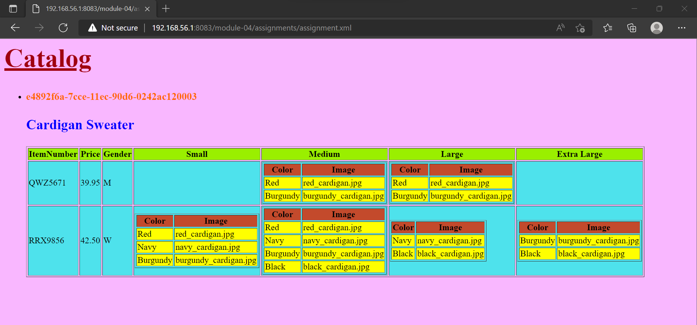
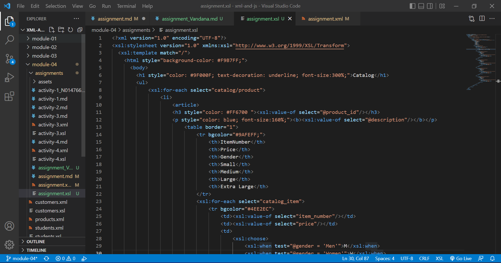
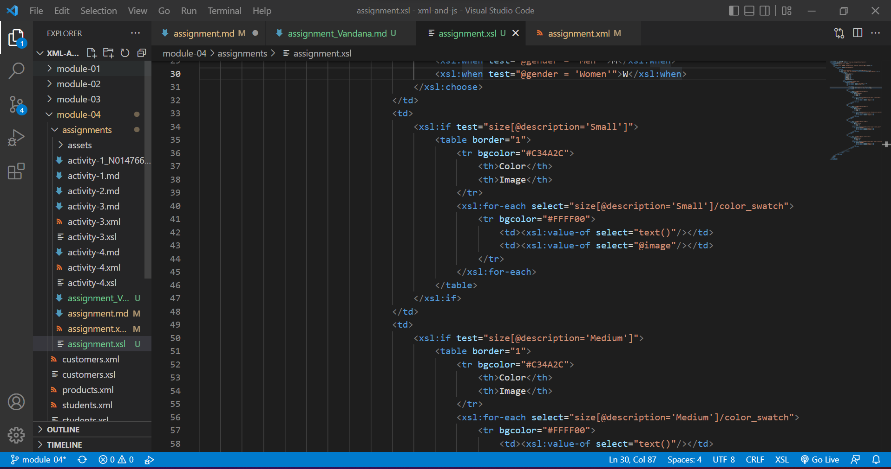
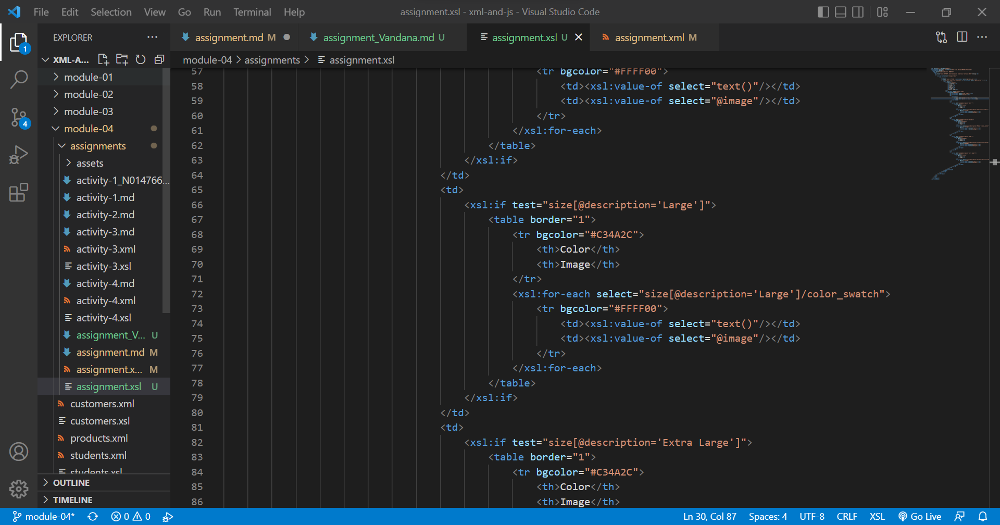
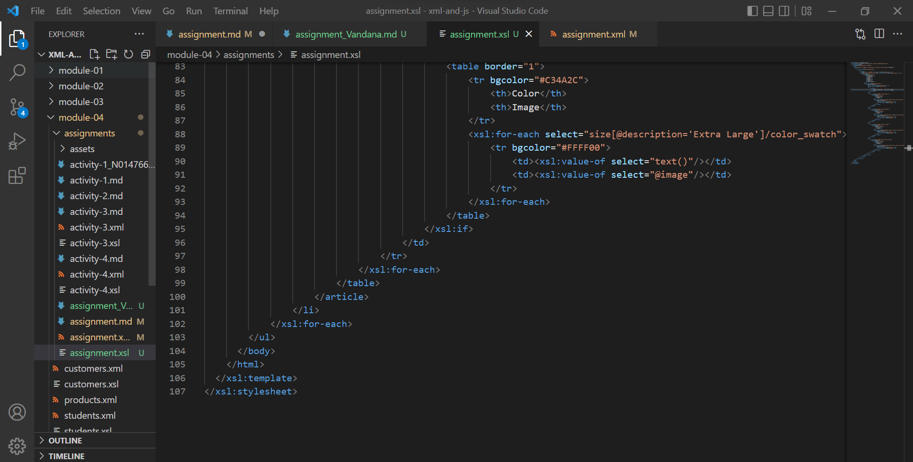

# Assignment

1. Open `module-4/assignments/assignment.xml` in your editor
2. Create xsl file and add link to it

3. Display catalog in the following way

- main title is "Catalog"
- use html list tag to display catalog
- render each item as `<article>` inside list item tag 

- display product id as h3

- display product description as paragraph

- render table of catalog items with columns: item number, price, gender, small, medium, large, extra large (if column item is not present in item, then display empty cell)
- for gender column render M for Men, W for Women
- inside size columns (small, medium, large, and extra large) display subtable with 2 columns: color and image

Create `module-4/assignments/assignment_YOURNAME.md` and explain your thought process in it. Add screenshots of each step to the file (Refer `week-1/assignments/evaluation-1.md` on how to add image to md file)

ANSWER:
Firstly, we will make a xsl file. In this i have faced chalenges as it was a tricky one as using html and xsl together using loops in between. through this i have learned a lot. now, we have first have  declative statements and then stating the HTML tag ans using styling for background. now giving main title with h1 tag for catalog in body. Then starting ul listtag and then in taht staring the for each list for getting product id and description. now there are rules defined as product id in h3 tag and description in paragraph tag. then starting list and article tag and all the table content and product id and description. now here its a trick that there is a table inside the table for color and image. Lastly we need the closing tags for each. 

images:

