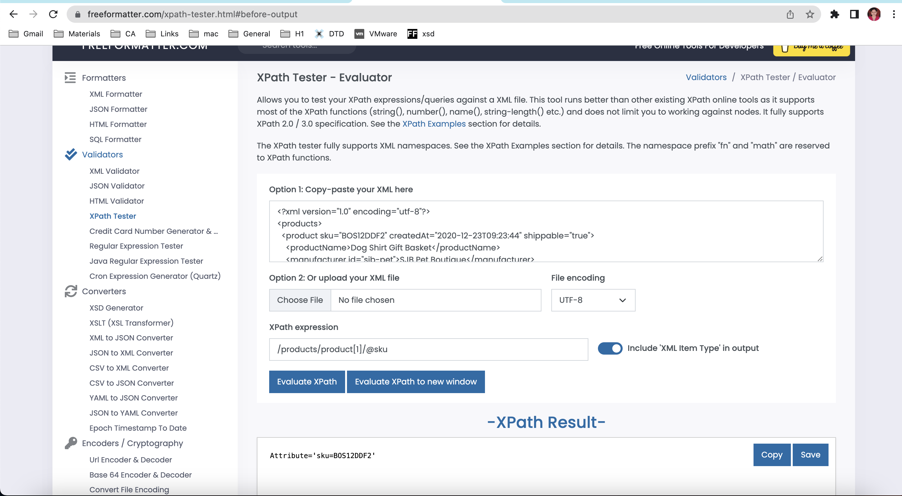

# Assignment

- Add "Catalog" in `h2` tag 
- Add <xsl:for-each select="catalog/product"> inside the `ul` tag to get the full list consisting of 1 item 
- Add an article tag inside the list item. Add `<xsl:value-of select="@product_id"/>` to verify that item is displayed 
- Put previous `xsl:value-of` into `h3` tag 
- Add `
<xsl:value-of select="@description"/>
 ` after `h3` tag
- Add a table with necessary columns. Then, add `<xsl:for-each select="catalog_item">` loop to add all rows. Inside each row, complete fields with `xsl:value-of` tags. Sizes are assigned into respective columns by `select="size[@description='`Size`']"` predicates 
- Replace `select="@gender"` with `xsl:choose`, 2 `xsl:when` for both genders, and `<xsl:otherwise>U</xsl:otherwise>` in case of unisex clothing 
- Add tables with 2 columns instead of `select="size"` and `<xsl:for-each select="size[@description='`Size`']/color_swatch">` to fill the rows. Additionally, add `<xsl:if test="size[@description='`Size`']">` around tables, so in case the size is not present, cell remains empty and the table with 0 rows is not created 
